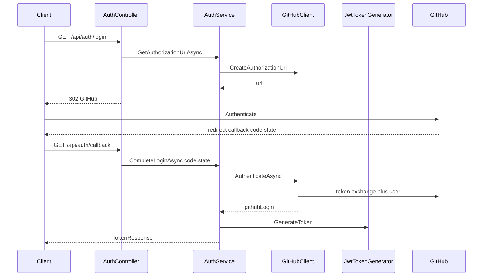

# Simplified Plan — Demo Login → GitHub OAuth2

Satisfy “OAuth2 Authentication” by swapping only the demo credential check for a GitHub Authorization Code callback, then reuse the existing app JWT path.

## Scope

**In scope**
- Replace demo `POST /api/auth/login` with GitHub Authorization Code (`GET /api/auth/login` redirect + `GET /api/auth/callback`).
- API is OAuth2 Client **only** to authenticate with GitHub.
- On success, call existing `IJwtTokenGenerator.GenerateToken(githubLogin)` and return existing `TokenResponse`.
- Remove demo `Auth:Username` / `Auth:Password`.
- Minimal config/Compose/`.env.example`/README updates.
- Update `AuthServiceTests` for the new flow.

**Out of scope**
- ADR / Cursor Rules / skill changes (README note only).
- ASP.NET Identity, Users table, persistence, cookies, sessions.
- Accepting GitHub tokens on protected endpoints.
- Generic OAuth/provider frameworks, Redis/distributed state.
- Changes to `JwtTokenGenerator`, `TokenResponse`, JwtBearer setup, Swagger Bearer scheme, Domain, or inventory features.

## Current vs Expected State

| Area | Current | Expected |
|------|---------|----------|
| Login | `POST /api/auth/login` + demo password | `GET /api/auth/login` → GitHub; `GET /api/auth/callback` → app JWT |
| Proof of identity | Config username/password | GitHub `code` → profile `login` |
| Token | App JWT via `JwtTokenGenerator` | Same (subject = GitHub login) |
| API auth | App JWT Bearer | Unchanged |
| Docs | Demo credentials in README | Short GitHub OAuth setup note in README |

## Files to Create

| File | Why |
|------|-----|
| [`src/Inventory.Application/Abstractions/Authentication/IGitHubOAuthClient.cs`](src/Inventory.Application/Abstractions/Authentication/IGitHubOAuthClient.cs) | Only new Application port (HTTP must stay out of Application): `CreateAuthorizationUrl()` + `AuthenticateAsync(code, state, ct)` → GitHub login |
| [`src/Inventory.Infrastructure/Authentication/GitHubOptions.cs`](src/Inventory.Infrastructure/Authentication/GitHubOptions.cs) | `ClientId`, `ClientSecret`, `RedirectUri` (hardcode GitHub URLs/scope in the client) |
| [`src/Inventory.Infrastructure/Authentication/GitHubOAuthClient.cs`](src/Inventory.Infrastructure/Authentication/GitHubOAuthClient.cs) | `HttpClient` token exchange + `/user`; in-memory one-time `state` (`ConcurrentDictionary` + short TTL) inside this class — **no separate state store interface** |

No `GitHubUserInfo` DTO, no `IOauthStateStore`, no generic OAuth layer.

## Files to Modify

| File | Change |
|------|--------|
| [`IAuthService.cs`](src/Inventory.Application/Services/Auth/IAuthService.cs) / [`AuthService.cs`](src/Inventory.Application/Services/Auth/AuthService.cs) | Keep service; replace password check with `GetAuthorizationUrlAsync` + `CompleteLoginAsync`; inject `IGitHubOAuthClient` + `IJwtTokenGenerator`; drop `IAuthConfiguration` |
| [`AuthController.cs`](src/Inventory.Api/Controllers/AuthController.cs) | `GET login` → `Redirect(url)`; `GET callback` → `Ok(TokenResponse)` |
| [`DependencyInjection.cs`](src/Inventory.Infrastructure/DependencyInjection.cs) (Infrastructure) | Bind `GitHubOptions`, `AddHttpClient<IGitHubOAuthClient, GitHubOAuthClient>()`; remove `AuthOptions` / `IAuthConfiguration`; **leave JwtBearer block untouched** |
| [`appsettings.json`](src/Inventory.Api/appsettings.json) / [`appsettings.Development.json`](src/Inventory.Api/appsettings.Development.json) | Replace `Auth` with `GitHub` placeholders |
| [`docker-compose.yml`](docker-compose.yml) / [`.env.example`](.env.example) | Swap `Auth__*` for `GitHub__ClientId`, `GitHub__ClientSecret`, `GitHub__RedirectUri` |
| [`README.md`](README.md) | Implementation note: GitHub OAuth App setup + login/callback → paste app JWT in Swagger |
| [`AuthServiceTests.cs`](tests/Inventory.Tests/Application/AuthServiceTests.cs) | Mock `IGitHubOAuthClient`; assert JWT generation on success; invalid state/code → `BusinessException` |

## Files to Delete

- [`LoginRequest.cs`](src/Inventory.Application/DTOs/Auth/LoginRequest.cs)
- [`IAuthConfiguration.cs`](src/Inventory.Application/Abstractions/Authentication/IAuthConfiguration.cs)
- [`AuthOptions.cs`](src/Inventory.Infrastructure/Authentication/AuthOptions.cs)
- [`AuthConfiguration.cs`](src/Inventory.Infrastructure/Authentication/AuthConfiguration.cs)

## Files Explicitly Unchanged

- `JwtTokenGenerator`, `IJwtTokenGenerator`, `JwtOptions`, `TokenResponse`
- JwtBearer registration/parameters in Infrastructure DI
- Swagger Bearer security definition
- ADR-003, Cursor rules/skills
- Domain / inventory controllers / CQRS

## Dependencies

- Application → `IGitHubOAuthClient` (new) + existing `IJwtTokenGenerator`
- Infrastructure → implements GitHub HTTP + in-memory state; still signs/validates app JWT as today
- No cookies, no second authentication scheme

## NuGet Packages

- **None new.** Use `IHttpClientFactory` / `AddHttpClient` already available via the ASP.NET host.
- Keep existing `Microsoft.AspNetCore.Authentication.JwtBearer` and `System.IdentityModel.Tokens.Jwt`.
- Do **not** add Identity, `AspNet.Security.OAuth.GitHub`, or Microsoft.Identity.Web.

## Implementation Order

1. Add `IGitHubOAuthClient` + rewrite `AuthService`/`IAuthService` + update tests (TDD).
2. Implement `GitHubOptions` + `GitHubOAuthClient` (state + HTTP); wire DI; delete demo auth types.
3. Update `AuthController` endpoints.
4. Minimal config/Compose/`.env.example`/README.
5. Build, test, manual GitHub → JWT → Swagger authorize smoke check.

## Risks

| Risk | Mitigation |
|------|------------|
| In-memory state fails with multiple API instances | Accept single-instance/local Docker; document in README |
| Redirect URI mismatch | Document exact callback URL; fail-fast if GitHub options empty |
| Breaking `POST /api/auth/login` clients | Expected; README notes new URLs |
| Accidental GitHub-token API auth | JwtBearer unchanged; GitHub token never returned |

## Validation Steps

1. `dotnet build` + unit tests pass.
2. Configure GitHub OAuth App; hit login → callback returns `TokenResponse`.
3. Swagger Authorize with that JWT → protected CRUD works; no token → 401.
4. Bearer with a GitHub access token → 401.
5. API starts with `GitHub__*` + existing `Jwt__*`; `Auth__*` gone.

## Definition of Done

- Demo password login removed.
- GitHub Authorization Code login/callback works; callback returns app JWT from existing `JwtTokenGenerator`.
- Protected endpoints still accept only app JWT; JwtBearer/`TokenResponse`/`JwtTokenGenerator` unchanged.
- No Identity, no user persistence, no ADR/rules edits, no cookies/sessions.
- Only the minimal file set above changed; README has the GitHub setup note.
- Tests and manual smoke path pass.
