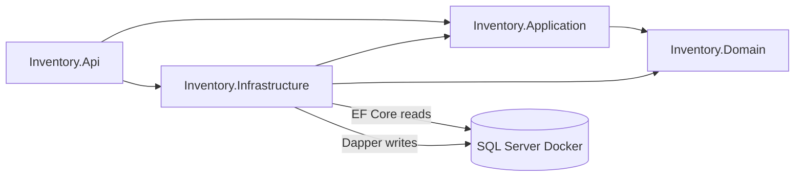
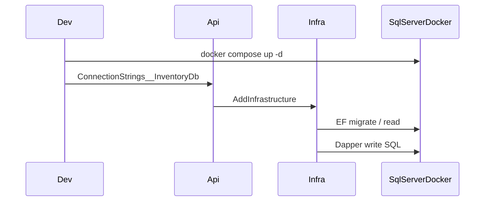

# Milestone 2 — Domain and Infrastructure

## Scope

In scope (from [docs/02-Plan.md](docs/02-Plan.md) Milestone 2 only):

- Define domain entities (and supporting enums/exceptions as needed)
- Create SQL Server schema via EF Core model + Fluent configuration
- Configure Entity Framework Core (read path)
- Configure Dapper (write path / SQL connection factory)
- Implement repository interfaces (Application) and implementations (Infrastructure)
- Create initial EF Core migrations
- Configure Docker Compose for SQL Server + connection-string wiring

Explicitly out of scope (Milestones 3–5):

- Application Services, DTOs, business rules, CQRS handlers/services
- REST controllers, exception middleware, OAuth2/JWT, Swagger
- Seed demo data
- Application-layer unit test suite (Moq against services)
- API `Dockerfile` and compose service for the API process (M5)

---

## Current state vs expected state


| Area                | Current                            | Expected after Milestone 2                                                                                        |
| ------------------- | ---------------------------------- | ----------------------------------------------------------------------------------------------------------------- |
| Domain              | Empty class library                | `Category`, `Product`, `InventoryMovement` + `MovementType`                                                       |
| Application         | Empty (refs Domain only)           | Persistence abstractions (read/write repository interfaces + IDbConnection) — no services/DTOs                    |
| Infrastructure      | Empty (refs App + Domain)          | `InventoryDbContext`, EF configs, Dapper connection factory, repository implementations, DI extension, Migrations |
| Api                 | Minimal host, no ConnectionStrings | Registers Infrastructure; `ConnectionStrings:InventoryDb` from config/env                                         |
| Docker              | Absent                             | `docker-compose.yml` with SQL Server 2022 + volume; env-driven SA password                                        |
| Schema / migrations | Absent                             | `InitialCreate` migration matching tables `Categories`, `Products`, `InventoryMovements`                          |
| Tests               | Assembly smoke tests               | Add focused (xUnit)                                                                                               |





---

## Concrete domain and schema (chosen defaults)

Aligned with [docs/01-Understanding.md](docs/01-Understanding.md) and backend rule table names (`Products`, `Categories`, `InventoryMovements`).

**Enums**

- `MovementType`: `Inbound = 1`, `Outbound = 2`

**Entities (Domain)**

- `Category`: `Id`, `Name`, `Description?`, `CreatedAtUtc`
- `Product`: `Id`, `CategoryId`, `Name`, `Description?`, `Sku`, `Stock`, `UnitPrice`, `CreatedAtUtc`, `UpdatedAtUtc?`
- `InventoryMovement`: `Id`, `ProductId`, `MovementType`, `Quantity`, `OccurredAtUtc`, `Notes?`

Keep Domain free of EF attributes; use public setters / constructors for basic invariants (non-empty name/sku, stock ≥ 0, quantity > 0). No Application business rules (stock sufficiency on outbound is Milestone 3).

**SQL Server tables**

- `Categories` — PK `Id` INT IDENTITY; `Name` NVARCHAR(100) NOT NULL; `Description` NVARCHAR(500) NULL; `CreatedAtUtc` DATETIME2 NOT NULL
- `Products` — PK `Id` INT IDENTITY; FK `CategoryId` → `Categories`; `Name` NVARCHAR(200); `Description` NVARCHAR(1000) NULL; `Sku` NVARCHAR(50) NOT NULL UNIQUE; `Stock` INT NOT NULL; `UnitPrice` DECIMAL(18,2) NOT NULL; `CreatedAtUtc` / `UpdatedAtUtc` DATETIME2
- `InventoryMovements` — PK `Id` INT IDENTITY; FK `ProductId` → `Products`; `MovementType` INT NOT NULL; `Quantity` INT NOT NULL; `OccurredAtUtc` DATETIME2 NOT NULL; `Notes` NVARCHAR(500) NULL

Schema source of truth: EF model + Fluent API + `InitialCreate` migration (no parallel hand-maintained `.sql` script).

---

## Files to create

### Domain — `[src/Inventory.Domain/](src/Inventory.Domain/)`

- `Entities/Category.cs`
- `Entities/Product.cs`
- `Entities/InventoryMovement.cs`
- `Enums/MovementType.cs`
- `Exceptions.cs` (simple base for invariant failures)

### Application — `[src/Inventory.Application/](src/Inventory.Application/)`

Persistence contracts only (ADR-002: interfaces live in Application):

- `Abstractions/Persistence/`IDbConnection`.cs`
- `Abstractions/Persistence/ICategoryRepository.cs`
- `Abstractions/Persistence/IProductRepository.cs`
- `Abstractions/Persistence/IInventoryMovementRepository.cs`

Read interfaces: query methods returning domain entities (or `null`), async + `CancellationToken`.  
Write interfaces: insert/update/delete (and movement insert) via Dapper; return generated ids where needed. No DTOs/services.

### Infrastructure — `[src/Inventory.Infrastructure/](src/Inventory.Infrastructure/)`

- `Persistence/InventoryDbContext.cs`
- `Persistence/Configurations/CategoryConfiguration.cs`
- `Persistence/Configurations/ProductConfiguration.cs`
- `Persistence/Configurations/InventoryMovementConfiguration.cs`
- `Persistence/SqlConnectionFactory.cs` (Dapper/`Microsoft.Data.SqlClient`)
- `Persistence/Repositories/CategoryRepository.cs` (EF, `AsNoTracking(),` Dapper, parameterized SQL)
- `Persistence/Repositories/ProductRepository.cs`
- `Persistence/Repositories/InventoryMovementRepository.cs`
- `DependencyInjection.cs` — `AddInfrastructure(this IServiceCollection, IConfiguration)`
- `Persistence/Migrations/*` — generated `InitialCreate`

### Docker / config root

- `[docker-compose.yml](docker-compose.yml)` — SQL Server 2022 only, named volume, port `1433:1433`, `MSSQL_SA_PASSWORD` / `ACCEPT_EULA` from env
- `[.env.example](.env.example)` — sample `MSSQL_SA_PASSWORD` (no real secrets committed)
- `[.dockerignore](.dockerignore)` — ignore `bin/`, `obj/`, `.git`, etc. (prep for later API image; no API Dockerfile in this milestone)

### Tests

- `tests/Inventory.Tests/Domain/CategoryTests.cs` (and thin Product/InventoryMovement invariant tests as needed)

---

## Files to modify

- `[src/Inventory.Infrastructure/Inventory.Infrastructure.csproj](src/Inventory.Infrastructure/Inventory.Infrastructure.csproj)` — add EF Core + Dapper + SqlClient packages
- `[src/Inventory.Api/Inventory.Api.csproj](src/Inventory.Api/Inventory.Api.csproj)` — add `Microsoft.EntityFrameworkCore.Design` (private assets) for EF tooling from startup project
- `[src/Inventory.Api/Program.cs](src/Inventory.Api/Program.cs)` — call `builder.Services.AddInfrastructure(builder.Configuration)` only (no controllers/auth/Swagger)
- `[src/Inventory.Api/appsettings.json](src/Inventory.Api/appsettings.json)` — `ConnectionStrings:InventoryDb` placeholder key (empty or documented pattern; no hardcoded secrets)
- `[src/Inventory.Api/appsettings.Development.json](src/Inventory.Api/appsettings.Development.json)` — local connection string to `localhost,1433` using env-overridable password pattern
- `[tests/Inventory.Tests/Inventory.Tests.csproj](tests/Inventory.Tests/Inventory.Tests.csproj)` — add FluentAssertions if used by Domain tests
- `[.gitignore](.gitignore)` — ensure `.env` is ignored (if not already)

Do **not** modify ADRs, skills, or Milestone 3–5 concerns.

---

## Project dependencies

Unchanged graph (ADR-002):

```text
Inventory.Application     → Inventory.Domain
Inventory.Infrastructure  → Inventory.Application, Inventory.Domain
Inventory.Api             → Inventory.Application, Inventory.Infrastructure
Inventory.Tests           → Inventory.Application, Inventory.Domain
```

Rules to preserve:

- Domain has zero package/project refs
- Application must not reference Infrastructure or EF/Dapper packages
- No `DbContext` injection into controllers (none exist yet; keep it that way)
- Reads = EF Core; writes = Dapper ([ADR-001](docs/adr/ADR-001-CQRS-Split-Read-Write.md))

---

## NuGet packages


| Project        | Packages                                                                                                                                                                                                                                                                                                     |
| -------------- | ------------------------------------------------------------------------------------------------------------------------------------------------------------------------------------------------------------------------------------------------------------------------------------------------------------ |
| Domain         | none                                                                                                                                                                                                                                                                                                         |
| Application    | none                                                                                                                                                                                                                                                                                                         |
| Infrastructure | `Microsoft.EntityFrameworkCore.SqlServer` (10.x), `Microsoft.EntityFrameworkCore.Design` (10.x, PrivateAssets), `Dapper`, `Microsoft.Data.SqlClient`, `Microsoft.Extensions.Configuration.Abstractions` / `DependencyInjection.Abstractions` / `Options.ConfigurationExtensions` as required by DI extension |
| Api            | `Microsoft.EntityFrameworkCore.Design` (10.x, PrivateAssets) for migrations startup project                                                                                                                                                                                                                  |
| Tests          | keep existing xUnit stack                                                                                                                                                                                                                                                                                    |


Pin EF packages to the same 10.0.x band as the `net10.0` TFM. Do not add JWT, Swagger, MediatR, or AutoMapper.

---

## Implementation order

1. **Domain entities + enum** (TDD: write Domain invariant tests first, then entities).
2. **Application persistence interfaces** (IDbConnection, read/write repos per aggregate).
3. **Infrastructure packages** on `Inventory.Infrastructure` (+ Design on Api).
4. **EF Core**: `InventoryDbContext`, Fluent configurations mapping exact table/column names, DI registration of DbContext.
5. **Dapper**: `SqlConnectionFactory` reading `ConnectionStrings:InventoryDb`.
6. **Repositories**: EF read repos with `AsNoTracking()`; Dapper write repos with parameterized SQL only (no string concatenation).
7. `**AddInfrastructure**` extension; wire from `Program.cs`.
8. **Connection strings** in appsettings + ensure override via environment variables (`ConnectionStrings__InventoryDb`).
9. **Docker Compose** SQL Server service + `.env.example`; start container locally.
10. **Initial migration**: `dotnet ef migrations add InitialCreate --project src/Inventory.Infrastructure --startup-project src/Inventory.Api`; apply with `dotnet ef database update` against the Docker SQL instance.
11. **Validate** build, tests, migration apply, and a quick smoke query/connection.




---

## ADR / skills / rules compliance


| Source                                                 | How Milestone 2 complies                                                                    |
| ------------------------------------------------------ | ------------------------------------------------------------------------------------------- |
| [ADR-001](docs/adr/ADR-001-CQRS-Split-Read-Write.md)   | Separate read (EF) and write (Dapper) repositories                                          |
| [ADR-002](docs/adr/ADR-002-Solution-Architecture.md)   | Entities in Domain; interfaces in Application; EF/Dapper/repos in Infrastructure            |
| [ADR-003](docs/adr/ADR-003-Authentication-OAuth2.md)   | Deferred — no auth packages or middleware                                                   |
| CleanArchitecture / CQRS / EF / Dapper / Docker skills | Layering, `AsNoTracking`, parameterized SQL, compose SQL with volumes, no hardcoded secrets |
| [backend.mdc](.cursor/rules/backend.mdc)               | Async + `CancellationToken`, table names, no DbContext in controllers, TDD for Domain       |


---

## Risks


| Risk                                               | Mitigation                                                                      |
| -------------------------------------------------- | ------------------------------------------------------------------------------- |
| Scope creep into Application Services/DTOs or REST | Stop at repositories + DI; no controllers/services                              |
| Dual schema drift (hand SQL + EF)                  | Migrations only as schema source of truth                                       |
| SA password / secrets in git                       | `.env` gitignored; `.env.example` placeholders; config via env                  |
| SQL Server container slow/unhealthy on first boot  | Healthcheck / retry before `database update`                                    |
| EF Design package placement                        | Design on Infrastructure + Api startup project; PrivateAssets                   |
| Read repos returning entities vs future DTOs       | Entities at repository boundary; DTO projection belongs to Milestone 3 services |
| Write repos updating stock without business rules  | Repos expose persistence only; stock rules in Milestone 3                       |


---

## Validation steps

1. `dotnet build Inventory.sln` — zero warnings (TreatWarningsAsErrors).
2. `dotnet test Inventory.sln` — smoke + Domain tests pass.
3. `docker compose up -d` — SQL Server healthy on `localhost:1433`.
4. `dotnet ef migrations list` / `database update` — `InitialCreate` applied.
5. Confirm tables `Categories`, `Products`, `InventoryMovements` exist in the Docker database.
6. Architecture checks: Application `.csproj` has no EF/Dapper packages; write repos use Dapper; read repos use `InventoryDbContext` + `AsNoTracking()`.
7. Api starts with valid connection string (no auth/Swagger required).

---

## Definition of Done

- Domain entities and `MovementType` exist and enforce basic invariants; covered by unit tests.
- Application defines read/write repository interfaces and IDbConnection only (no services/DTOs).
- Infrastructure configures EF Core + Dapper, implements all repositories, and exposes `AddInfrastructure`.
- `InitialCreate` migration exists and applies cleanly to Docker SQL Server.
- `docker-compose.yml` runs SQL Server 2022 with persisted volume; connection string comes from configuration/environment only.
- Solution builds; existing and new tests pass.
- No Milestone 3–5 deliverables (services, REST, JWT, Swagger, seed data, API image) are present.

