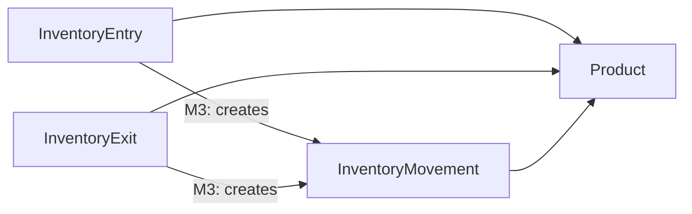
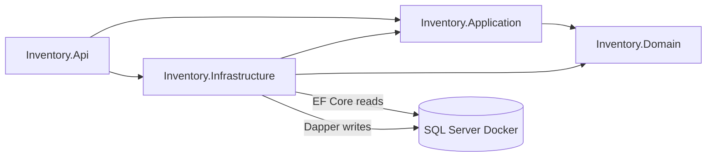
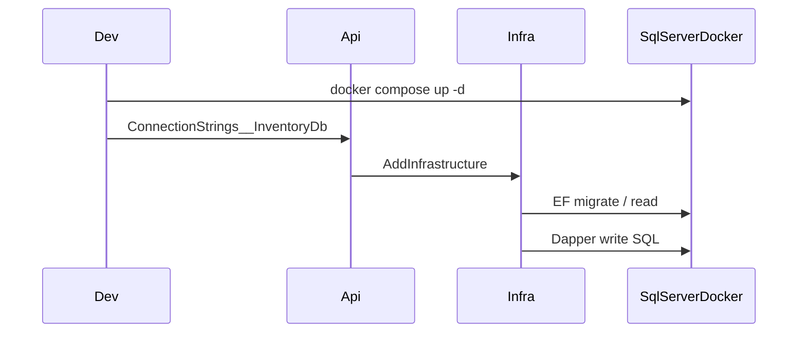

# Milestone 2 — Domain and Infrastructure (revised)

## Scope

In scope (from [docs/02-Plan.md](docs/02-Plan.md) Milestone 2 only):

- Define domain entities (and supporting enums/exceptions as needed)
- Create SQL Server schema via EF Core model + Fluent configuration
- Configure Entity Framework Core (read path)
- Configure Dapper (write path / SQL connection factory)
- Implement repository interfaces (Application) and implementations (Infrastructure)
- Create initial EF Core migrations
- Configure Docker Compose for SQL Server + connection-string wiring

Explicitly out of scope (Milestones 3–5):

- Application Services, DTOs, business rules, CQRS handlers/services
- Automatic creation of `InventoryMovement` when an entry/exit is written (Application orchestration — Milestone 3)
- REST controllers, exception middleware, OAuth2/JWT, Swagger
- Seed demo data
- Application-layer unit test suite (Moq against services)
- API `Dockerfile` and compose service for the API process (M5)

Do not change ADRs, skills, rules, or Milestone 3–5 deliverables while executing this plan.

---

## Alignment with business requirements

From [docs/01-Understanding.md](docs/01-Understanding.md), the inventory domain manages:

- Product Categories
- Products
- Inventory Entries (inbound transactions)
- Inventory Exits (outbound transactions)
- Inventory Movement History (kardex / audit trail)

**Roles (chosen model):**

| Concept | Role |
| --- | --- |
| `InventoryEntry` | Primary inbound business transaction |
| `InventoryExit` | Primary outbound business transaction |
| `InventoryMovement` | History/kardex line only — not the primary transaction |

Milestone 2 persists all five entity types. Milestone 3 will enforce: creating an entry or exit also inserts the corresponding `InventoryMovement` and updates product stock.



---

## Current state vs expected state

| Area | Current | Expected after Milestone 2 |
| --- | --- | --- |
| Domain | Empty class library | `Category`, `Product`, `InventoryEntry`, `InventoryExit`, `InventoryMovement` + `MovementType` |
| Application | Empty (refs Domain only) | Persistence abstractions (read/write repository interfaces + `ISqlConnectionFactory`) — no services/DTOs |
| Infrastructure | Empty (refs App + Domain) | `InventoryDbContext`, EF configs, Dapper connection factory, repository implementations, DI extension, Migrations |
| Api | Minimal host, no ConnectionStrings | Registers Infrastructure; `ConnectionStrings:InventoryDb` from config/env |
| Docker | Absent | `docker-compose.yml` with SQL Server 2022 + volume; env-driven SA password |
| Schema / migrations | Absent | `InitialCreate` with `Categories`, `Products`, `InventoryEntries`, `InventoryExits`, `InventoryMovements` |
| Tests | Assembly smoke tests | none |



---

## Concrete domain and schema (chosen defaults)

**Enums**

- `MovementType`: `Inbound = 1`, `Outbound = 2` — used only on `InventoryMovement` (history). Entry/Exit entities do not carry this enum.

**Entities (Domain)**

- `Category`: `Id`, `Name`, `Description?`, `CreatedAtUtc`
- `Product`: `Id`, `CategoryId`, `Name`, `Description?`, `Stock`, `UnitPrice`, `CreatedAtUtc`, `UpdatedAtUtc?`
- `InventoryEntry`: `Id`, `ProductId`, `Quantity`, `Notes?`, `CreatedAtUtc`
- `InventoryExit`: `Id`, `ProductId`, `Quantity`, `Notes?`, `CreatedAtUtc`
- `InventoryMovement`: `Id`, `ProductId`, `MovementType`, `Quantity`, `Notes?`, `ReferenceId?`

`ReferenceId` on the movement are optional FKs for audit linkage (at most one set per row). No domain service auto-creates movements in M2.

Keep Domain free of EF attributes; use public setters / constructors for basic invariants (non-empty name, stock ≥ 0, quantity > 0). No Application business rules (stock sufficiency, movement generation) in this milestone.

**SQL Server tables**

- `Categories` — PK `Id` INT IDENTITY; `Name` NVARCHAR(100) NOT NULL; `Description` NVARCHAR(500) NULL; `CreatedAtUtc` DATETIME2 NOT NULL
- `Products` — PK `Id` INT IDENTITY; FK `CategoryId` → `Categories`; `Name` NVARCHAR(200); `Description` NVARCHAR(1000) NULL; `Stock` INT NOT NULL; `UnitPrice` DECIMAL(18,2) NOT NULL; `CreatedAtUtc` / `UpdatedAtUtc` DATETIME2
- `InventoryEntries` — PK `Id` INT IDENTITY; FK `ProductId` → `Products`; `Quantity` INT NOT NULL; `Notes` NVARCHAR(500) NULL; `CreatedAtUtc` DATETIME2 NOT NULL
- `InventoryExits` — PK `Id` INT IDENTITY; FK `ProductId` → `Products`; `Quantity` INT NOT NULL; `Notes` NVARCHAR(500) NULL; `CreatedAtUtc` DATETIME2 NOT NULL
- `InventoryMovements` — PK `Id` INT IDENTITY; FK `ProductId` → `Products`; `MovementType` INT NOT NULL; `Quantity` INT NOT NULL; `Notes` NVARCHAR(500) NULL; nullable INT `ReferenceId` → `InventoryEntries`

Schema source of truth: EF model + Fluent API + `InitialCreate` migration (no parallel hand-maintained `.sql` script).

---

## Files to create

### Domain — [src/Inventory.Domain/](src/Inventory.Domain/)

- `Entities/Category.cs`
- `Entities/Product.cs`
- `Entities/InventoryEntry.cs`
- `Entities/InventoryExit.cs`
- `Entities/InventoryMovement.cs`
- `Enums/MovementType.cs`
- `Exceptions.cs` (simple base for invariant failures)

### Application — [src/Inventory.Application/](src/Inventory.Application/)

Persistence contracts only (ADR-002: interfaces live in Application):

- `Abstractions/Persistence/ISqlConnectionFactory.cs`
- `Abstractions/Persistence/ICategoryRepository.cs`
- `Abstractions/Persistence/IProductRepository.cs`
- `Abstractions/Persistence/IInventoryEntryRepository.cs`
- `Abstractions/Persistence/IInventoryExitRepository.cs`
- `Abstractions/Persistence/IInventoryMovementRepository.cs`

Read interfaces: query methods returning domain entities (or `null`), async + `CancellationToken`.  
Write interfaces: insert/update/delete (and movement insert) via Dapper; return generated ids where needed. No DTOs/services. No method that “creates entry and movement together” — that orchestration is Milestone 3.

### Infrastructure — [src/Inventory.Infrastructure/](src/Inventory.Infrastructure/)

- `Persistence/InventoryDbContext.cs` — `DbSet` for all five entities
- `Persistence/Configurations/CategoryConfiguration.cs`
- `Persistence/Configurations/ProductConfiguration.cs`
- `Persistence/Configurations/InventoryEntryConfiguration.cs`
- `Persistence/Configurations/InventoryExitConfiguration.cs`
- `Persistence/Configurations/InventoryMovementConfiguration.cs`
- `Persistence/SqlConnectionFactory.cs` (Dapper / `Microsoft.Data.SqlClient`)
- `Persistence/Repositories/CategoryRepository.cs` (EF reads with `AsNoTracking()`; Dapper writes, parameterized SQL)
- `Persistence/Repositories/ProductRepository.cs`
- `Persistence/Repositories/InventoryEntryRepository.cs`
- `Persistence/Repositories/InventoryExitRepository.cs`
- `Persistence/Repositories/InventoryMovementRepository.cs`
- `DependencyInjection.cs` — `AddInfrastructure(this IServiceCollection, IConfiguration)`
- `Persistence/Migrations/*` — generated `InitialCreate` including all five tables

### Docker / config root

- [docker-compose.yml](docker-compose.yml) — SQL Server 2022 only, named volume, port `1433:1433`, `MSSQL_SA_PASSWORD` / `ACCEPT_EULA` from env
- [.env.example](.env.example) — sample `MSSQL_SA_PASSWORD` (no real secrets committed)
- [.dockerignore](.dockerignore) — ignore `bin/`, `obj/`, `.git`, etc.

### Tests

- `tests/Inventory.Tests/Domain/CategoryTests.cs` (and thin Product / InventoryEntry / InventoryExit / InventoryMovement invariant tests as needed)

---

## Files to modify

- [src/Inventory.Infrastructure/Inventory.Infrastructure.csproj](src/Inventory.Infrastructure/Inventory.Infrastructure.csproj) — EF Core + Dapper + SqlClient packages
- [src/Inventory.Api/Inventory.Api.csproj](src/Inventory.Api/Inventory.Api.csproj) — `Microsoft.EntityFrameworkCore.Design` (PrivateAssets) for EF tooling
- [src/Inventory.Api/Program.cs](src/Inventory.Api/Program.cs) — `builder.Services.AddInfrastructure(builder.Configuration)` only
- [src/Inventory.Api/appsettings.json](src/Inventory.Api/appsettings.json) — `ConnectionStrings:InventoryDb` placeholder
- [src/Inventory.Api/appsettings.Development.json](src/Inventory.Api/appsettings.Development.json) — local `localhost,1433` pattern
- [tests/Inventory.Tests/Inventory.Tests.csproj](tests/Inventory.Tests/Inventory.Tests.csproj) — FluentAssertions if used by Domain tests
- [.gitignore](.gitignore) — ensure `.env` is ignored

Do **not** modify ADRs, skills, or Milestone 3–5 concerns.

---

## Project dependencies

Unchanged graph (ADR-002):

```text
Inventory.Application     → Inventory.Domain
Inventory.Infrastructure  → Inventory.Application, Inventory.Domain
Inventory.Api             → Inventory.Application, Inventory.Infrastructure
Inventory.Tests           → Inventory.Application, Inventory.Domain
```

Rules to preserve:

- Domain has zero package/project refs
- Application must not reference Infrastructure or EF/Dapper packages
- No `DbContext` injection into controllers
- Reads = EF Core; writes = Dapper ([ADR-001](docs/adr/ADR-001-CQRS-Split-Read-Write.md))

---

## NuGet packages

| Project | Packages |
| --- | --- |
| Domain | none |
| Application | none |
| Infrastructure | `Microsoft.EntityFrameworkCore.SqlServer` (10.x), `Microsoft.EntityFrameworkCore.Design` (10.x, PrivateAssets), `Dapper`, `Microsoft.Data.SqlClient`, configuration/DI abstractions as needed by `AddInfrastructure` |
| Api | `Microsoft.EntityFrameworkCore.Design` (10.x, PrivateAssets) for migrations startup project |
| Tests | keep existing xUnit stack |

Pin EF to the same 10.0.x band as `net10.0`. Do not add JWT, Swagger, MediatR, or AutoMapper.

---

## Implementation order

1. **Domain entities + enum** (TDD): Category, Product, InventoryEntry, InventoryExit, InventoryMovement, `MovementType`.
2. **Application persistence interfaces**: `ISqlConnectionFactory` + read/write repos for all five entities.
3. **Infrastructure packages** on `Inventory.Infrastructure` (+ Design on Api).
4. **EF Core**: `InventoryDbContext`, Fluent configs for all five tables (exact names above), DI registration of DbContext.
5. **Dapper**: `SqlConnectionFactory` reading `ConnectionStrings:InventoryDb`.
6. **Repositories**: EF read repos with `AsNoTracking()`; Dapper write repos with parameterized SQL only.
7. **`AddInfrastructure`** extension; wire from `Program.cs`.
8. **Connection strings** in appsettings + env override (`ConnectionStrings__InventoryDb`).
9. **Docker Compose** SQL Server + `.env.example`; start container locally.
10. **Initial migration**: `dotnet ef migrations add InitialCreate --project src/Inventory.Infrastructure --startup-project src/Inventory.Api`; apply with `dotnet ef database update` against Docker SQL.
11. **Validate** build, tests, migration apply, and table presence for all five tables.



---

## ADR / skills / rules compliance

| Source | How Milestone 2 complies |
| --- | --- |
| [ADR-001](docs/adr/ADR-001-CQRS-Split-Read-Write.md) | Separate read (EF) and write (Dapper) repositories |
| [ADR-002](docs/adr/ADR-002-Solution-Architecture.md) | Entities in Domain; interfaces in Application; EF/Dapper/repos in Infrastructure |
| [ADR-003](docs/adr/ADR-003-Authentication-OAuth2.md) | Deferred — no auth packages or middleware |
| CleanArchitecture / CQRS / EF / Dapper / Docker skills | Layering, `AsNoTracking`, parameterized SQL, compose SQL with volumes, no hardcoded secrets |
| [backend.mdc](.cursor/rules/backend.mdc) | Async + `CancellationToken`, no DbContext in controllers, TDD for Domain; schema includes `InventoryEntries` and `InventoryExits` in addition to listed tables |

---

## Risks

| Risk | Mitigation |
| --- | --- |
| Treating `InventoryMovement` as the only inventory write model | Model Entry/Exit as primary entities; Movement is history with optional source FKs |
| Implementing movement auto-generation in M2 | Keep generation in Milestone 3 Application services; M2 only exposes repos |
| Scope creep into Application Services/DTOs or REST | Stop at repositories + DI |
| Dual schema drift | Migrations only as schema source of truth |
| SA password / secrets in git | `.env` gitignored; `.env.example` placeholders |
| SQL Server slow on first boot | Healthcheck / retry before `database update` |
| Write repos updating stock without business rules | Repos expose persistence only; stock + movement rules in Milestone 3 |

---

## Validation steps

1. `dotnet build Inventory.sln` — zero warnings (`TreatWarningsAsErrors`).
2. `dotnet test Inventory.sln` — smoke + Domain tests pass.
3. `docker compose up -d` — SQL Server healthy on `localhost:1433`.
4. `dotnet ef migrations list` / `database update` — `InitialCreate` applied.
5. Confirm tables `Categories`, `Products`, `InventoryEntries`, `InventoryExits`, `InventoryMovements` exist in the Docker database.
6. Architecture checks: Application `.csproj` has no EF/Dapper packages; write repos use Dapper; read repos use `InventoryDbContext` + `AsNoTracking()`.
7. Api starts with valid connection string (no auth/Swagger required).
8. Confirm Domain/Application expose `InventoryEntry` and `InventoryExit` as first-class types (not only `InventoryMovement`).

---

## Definition of Done

- Domain entities (`Category`, `Product`, `InventoryEntry`, `InventoryExit`, `InventoryMovement`) and `MovementType` exist and enforce basic invariants; covered by unit tests.
- `InventoryEntry` / `InventoryExit` are primary inventory transaction entities; `InventoryMovement` is the kardex/history entity with optional links to entry/exit.
- Application defines read/write repository interfaces for all five entities and `ISqlConnectionFactory` only (no services/DTOs; no entry/exit→movement orchestration).
- Infrastructure configures EF Core + Dapper, Fluent configs and repositories for all five entities, and exposes `AddInfrastructure`.
- `InitialCreate` migration includes all five tables and applies cleanly to Docker SQL Server.
- `docker-compose.yml` runs SQL Server 2022 with persisted volume; connection string comes from configuration/environment only.
- Solution builds; existing and new tests pass.
- No Milestone 3–5 deliverables (services, REST, JWT, Swagger, seed data, API image, auto movement generation) are present.
