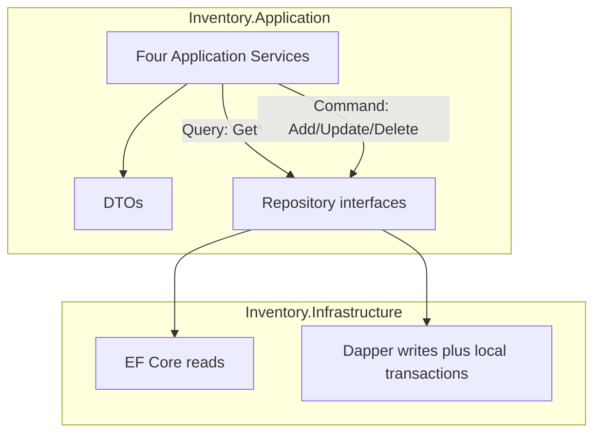

# Milestone 3 — Application Layer (Simplified)

## Scope

In scope (from [docs/02-Plan.md](docs/02-Plan.md) Milestone 3 only):

- Four Application Services + DI registration (`AddApplication`)
- DTOs (request/response)
- Business rules in Application (stock updates, movement auto-generation, existence/sufficiency checks, delete restrictions)
- Read path: Query methods call repository **Get** APIs only (EF Core behind interfaces — [ADR-001](docs/adr/ADR-001-CQRS-Split-Read-Write.md))
- Write path: Command methods call repository **Add/Update/Delete** APIs only (Dapper behind interfaces)
- Multi-step write atomicity handled **inside Infrastructure Dapper repositories** with `IDbConnection` / `IDbTransaction` when needed (no Application transaction abstraction)
- TDD unit tests for the four services only

Explicitly out of scope:

- `IUnitOfWork` / any UnitOfWork / transaction abstraction in Application
- `InventoryMovementService` (movement is a side effect of entry/exit)
- MediatR, pipeline behaviors, command/query handlers
- AutoMapper or other mapping libraries
- Controllers, exception middleware, OAuth2, Swagger, seed data (M4)
- Docker image / Compose API / full-flow validation (M5)

Do not change ADRs, skills, or rules while executing this plan.

---

## Layer responsibilities


| Layer              | Responsibility                                                       |
| ------------------ | -------------------------------------------------------------------- |
| **Domain**         | Entities and domain validations only                                 |
| **Application**    | DTOs, business rules, orchestration, repository interfaces, services |
| **Infrastructure** | EF Core, Dapper, repository implementations, database access only    |
| **API**            | Controllers, authentication, middleware, dependency injection        |


Hard rules:

- Business rules must **never** live in repositories or controllers.
- Repositories perform **data access only** (no stock logic, no “also create movement” decisions).
- Application Services orchestrate business rules only: **no SQL**, **no `DbContext`**, **only Application repository interfaces**.
- Repositories should expose business-oriented operations instead of generic CRUD methods whenever a use case requires atomic persistence. Example: CreateInventoryEntryAsync() CreateInventoryExitAsync() instead of multiple Add/Update calls coordinated by the Application layer.

---

## Chosen approach

Aligned with [ADR-002](docs/adr/ADR-002-Solution-Architecture.md) and skills; deliberately minimal:

- **Exactly four services**: `CategoryService`, `ProductService`, `InventoryEntryService`, `InventoryExitService`.
- **CQRS inside those services** (no MediatR): Query methods → EF-backed `Get`*; Command methods → Dapper-backed `Add`/`Update`/`Delete`. Commands return `int` (new id) or `Task` — not rich graphs ([CQRS skill](.cursor/skills/CQRS/SKILL.md)).
- **Manual DTO mapping** inside services. No AutoMapper.
- **InventoryMovement** is not an independent process: Entry/Exit services decide when to create a movement and call `IInventoryMovementRepository.AddAsync`. History reads use existing `IInventoryMovementRepository` Get methods from Entry/Exit services (or later API) as needed—**no dedicated movement service**.
- **Transactions stay in Infrastructure**: when a repository method (or a small set of coordinated Dapper writes owned by Infrastructure) must insert entry/exit + update product + insert movement atomically, open one connection, begin `IDbTransaction`, commit/rollback locally. Application never sees transactions.




---

## Current state vs expected state


| Area                | Current (after M2)             | Expected after Milestone 3                                                                                        |
| ------------------- | ------------------------------ | ----------------------------------------------------------------------------------------------------------------- |
| Application         | Persistence abstractions only  | DTOs, four services, `BusinessException` / `NotFoundException`, `AddApplication()`                                |
| CQRS at Application | Split only inside repositories | Query methods → read repos → DTOs; Command methods → write repos + rules                                          |
| Business rules      | Domain invariants only         | Entry/exit update stock; auto-create `InventoryMovement`; insufficient stock; NotFound / delete restrictions      |
| InventoryMovement   | Repository only                | Still repository only; created by Entry/Exit services; **no** `InventoryMovementService`                          |
| Transactions        | None                           | Local `IDbConnection`/`IDbTransaction` inside Dapper repository write paths when multi-step; **no** `IUnitOfWork` |
| API DI              | `AddInfrastructure` only       | Also `AddApplication()` (no controllers)                                                                          |
| Tests               | Domain + architecture smoke    | Unit tests for the four services only                                                                             |


---

## Business rules (Application)


| Operation                   | Rules                                                                                                                               | Exception                                                      |
| --------------------------- | ----------------------------------------------------------------------------------------------------------------------------------- | -------------------------------------------------------------- |
| Category create/update      | Name required (domain); update requires existing id                                                                                 | `NotFoundException` if missing                                 |
| Category delete             | Fail if products exist (`Restrict` FK)                                                                                              | `BusinessException`                                            |
| Product create/update       | Category must exist; name/stock/price validated by domain                                                                           | `NotFoundException` / domain / `BusinessException`             |
| Product delete              | Fail if any entry, exit, or movement references the product                                                                         | `BusinessException`                                            |
| Inventory entry create      | Product must exist; insert entry; increase stock; insert `InventoryMovement` (`Inbound`, `ReferenceId` = entry id)                  | `NotFoundException`                                            |
| Inventory exit create       | Product must exist; stock ≥ quantity; insert exit; decrease stock; insert `InventoryMovement` (`Outbound`, `ReferenceId` = exit id) | `NotFoundException` / `BusinessException` (insufficient stock) |
| Inventory entry/exit delete | Reverse stock; delete entry/exit row; **keep** movement history                                                                     | `NotFoundException`                                            |


Atomic multi-step persistence for entry/exit create (and delete with stock reverse) is implemented in Infrastructure with a local Dapper transaction—not via Application `IUnitOfWork`.

---

## Files to create

### Application — DTOs

Under `[src/Inventory.Application/DTOs/](src/Inventory.Application/)`:

- `Categories/CategoryDto.cs`, `CreateCategoryRequest.cs`, `UpdateCategoryRequest.cs`
- `Products/ProductDto.cs`, `CreateProductRequest.cs`, `UpdateProductRequest.cs`
- `Inventory/InventoryEntryDto.cs`, `CreateInventoryEntryRequest.cs`
- `Inventory/InventoryExitDto.cs`, `CreateInventoryExitRequest.cs`
- `Inventory/InventoryMovementDto.cs` (for mapping when entry/exit queries include or return related history reads; keep as planned)

### Application — Exceptions

- `Exceptions/BusinessException.cs` — validation and business rule violations (insufficient stock, delete restrictions, etc.)
- `Exceptions/NotFoundException.cs` — missing entities

No base `ApplicationException`, `ConflictException`, or `InsufficientStockException`.

### Application — Services (exactly four)

- `Services/Categories/ICategoryService.cs`, `CategoryService.cs`
- `Services/Products/IProductService.cs`, `ProductService.cs`
- `Services/Inventory/IInventoryEntryService.cs`, `InventoryEntryService.cs`
- `Services/Inventory/IInventoryExitService.cs`, `InventoryExitService.cs`

Do **not** create `InventoryMovementService`.

Service method shape (illustrative):

```csharp
// Queries — EF via repository Get*
Task<CategoryDto?> GetByIdAsync(int id, CancellationToken ct);
Task<IReadOnlyList<CategoryDto>> GetAllAsync(CancellationToken ct);

// Commands — Dapper via repository Add/Update/Delete
Task<int> CreateAsync(CreateCategoryRequest request, CancellationToken ct);
Task UpdateAsync(int id, UpdateCategoryRequest request, CancellationToken ct);
Task DeleteAsync(int id, CancellationToken ct);
```

### Application — DI

- `DependencyInjection.cs` — `AddApplication()` registers the four services as scoped

### Tests (TDD)

Under `[tests/Inventory.Tests/Application/](tests/Inventory.Tests/)`:

- `CategoryServiceTests.cs`
- `ProductServiceTests.cs`
- `InventoryEntryServiceTests.cs`
- `InventoryExitServiceTests.cs`

Cover success paths, `NotFoundException`, `BusinessException` (insufficient stock, delete restrictions), and entry/exit orchestration (stock + movement via Moq on repositories).

---

## Files to modify


| File                                                                                                               | Change                                                                                                                      |
| ------------------------------------------------------------------------------------------------------------------ | --------------------------------------------------------------------------------------------------------------------------- |
| `[src/Inventory.Application/Inventory.Application.csproj](src/Inventory.Application/Inventory.Application.csproj)` | Add DI abstractions package                                                                                                 |
| Selected Infrastructure repositories (Product, InventoryEntry, InventoryExit, InventoryMovement as needed)         | Where multi-step writes must be atomic, use one `IDbConnection` + `IDbTransaction` locally; keep SQL in Infrastructure only |
| `[src/Inventory.Infrastructure/DependencyInjection.cs](src/Inventory.Infrastructure/DependencyInjection.cs)`       | No `IUnitOfWork` registration                                                                                               |
| `[src/Inventory.Api/Program.cs](src/Inventory.Api/Program.cs)`                                                     | `builder.Services.AddApplication();`                                                                                        |


Do **not** add `IUnitOfWork`, `UnitOfWork.cs`, or change `ISqlConnectionFactory` into a session/UoW abstraction.

Prefer mutating `Product.Stock` / `UpdatedAtUtc` in services and persisting via `IProductRepository.UpdateAsync`. Repositories remain pure data access; orchestration of “update stock then add movement” stays in Entry/Exit services. If a single Dapper transactional method is required for atomicity, keep it as a focused repository write API (still no business decisions in SQL)—or coordinate sequential Dapper calls inside one Infrastructure helper that Entry/Exit repository methods use. Prefer the simplest option that keeps transactions local to Infrastructure without leaking into Application.

**Preferred simple pattern for entry create atomicity:** extend Infrastructure so the entry (or a dedicated write method used only by the entry flow) performs the related Dapper statements in one transaction **only if** that remains data-access composition without encoding business rules in SQL. Otherwise, Entry/Exit services call repositories sequentially; document the consistency tradeoff. Given the assessment goal, use **local Dapper transaction inside Infrastructure** for the coordinated writes that Entry/Exit services trigger—e.g. repository methods accept already-decided entities and persist them transactionally, while **stock sufficiency and “must create movement” decisions stay in the Application service**.

Concrete split:

1. Application service validates the business rules and decides the new stock value.
2. Infrastructure persists the changes.
3. Infrastructure may wrap the related inserts/updates in one `IDbTransaction` when multiple Dapper statements must succeed together (implementation detail of write repositories / factory usage)—Application still has no transaction type.

---

## Project dependencies

Unchanged ([ADR-002](docs/adr/ADR-002-Solution-Architecture.md)):

```text
Domain ← Application ← Infrastructure ← Api
                ↑
              Tests
```

- Application depends only on Domain (+ DI abstractions NuGet).
- Application must **not** reference EF Core, Dapper, SqlClient, or Infrastructure.
- Services depend only on repository interfaces defined in Application.

---

## NuGet packages


| Project                    | Package                                                            | Action          |
| -------------------------- | ------------------------------------------------------------------ | --------------- |
| `Inventory.Application`    | `Microsoft.Extensions.DependencyInjection.Abstractions` **10.0.0** | Add             |
| `Inventory.Infrastructure` | existing Dapper / EF / SqlClient                                   | Unchanged       |
| `Inventory.Tests`          | xUnit, Moq, FluentAssertions                                       | Already present |


Do **not** add MediatR, AutoMapper, FluentValidation, or UnitOfWork packages.

---

## Implementation order

1. **TDD — failing tests** for `CategoryService` / `ProductService` (CRUD, NotFound, delete restrictions).
2. **DTOs** + `BusinessException` / `NotFoundException`.
3. Implement `**CategoryService` / `ProductService**`; register in `AddApplication()`.
4. **TDD — failing tests** for `InventoryEntryService` / `InventoryExitService` (stock, auto-movement, insufficient stock).
5. Implement **Entry/Exit services**; adjust Infrastructure Dapper writes for local transactions where multi-step persistence requires it.
6. Wire `**AddApplication()**` in `Program.cs`.
7. Build + run all tests; fix `TreatWarningsAsErrors` issues.
8. Closeout: confirm no `IUnitOfWork`, no `InventoryMovementService`, no controllers/auth/Swagger.

---

## Risks


| Risk                                      | Mitigation                                                                  |
| ----------------------------------------- | --------------------------------------------------------------------------- |
| Multi-step writes without Application UoW | Local `IDbConnection`/`IDbTransaction` in Infrastructure Dapper write paths |
| Business logic leaking into repositories  | Services decide; repositories only persist entities/SQL                     |
| Scope creep into REST/auth                | Stop at services + DI                                                       |
| FK `Restrict` as raw SQL errors           | Pre-check in Application; throw `BusinessException` / `NotFoundException`   |
| Overbuilding movement APIs                | No movement service; only repo Get/Add used by Entry/Exit                   |


---

## Validation steps

1. `dotnet build Inventory.sln` — zero warnings/errors.
2. `dotnet test Inventory.sln` — Domain + four service test classes pass.
3. Manual review:
  - Exactly four Application services registered.
  - Query methods call only `Get*` repository methods.
  - Command methods call only `Add`/`Update`/`Delete`.
  - No SQL, no `DbContext`, no Dapper types in Application.
  - No `IUnitOfWork` / UnitOfWork types anywhere.
  - No `InventoryMovementService`.
  - Entry create → stock↑ + Inbound movement; Exit create → stock↓ + Outbound movement; insufficient stock → `BusinessException`.
  - No controllers, auth, or Swagger beyond `AddApplication()`.

---

## Definition of Done

- [ ] DTOs exist for Category, Product, InventoryEntry, InventoryExit, InventoryMovement (plus create/update requests where applicable).
- [ ] Exactly four Application services implemented and registered via `AddApplication()`: Category, Product, InventoryEntry, InventoryExit.
- [ ] No `InventoryMovementService`; movements created only by Entry/Exit services via `IInventoryMovementRepository`.
- [ ] Exceptions limited to `BusinessException` and `NotFoundException`.
- [ ] No `IUnitOfWork` or Application-level transaction abstraction; Dapper transactions (if any) are local to Infrastructure.
- [ ] Business rules enforced only in Application services; repositories and (future) controllers contain no business rules.
- [ ] Services use only Application repository interfaces; no SQL; no `DbContext`.
- [ ] Query methods use EF-backed reads; Command methods use Dapper-backed writes; no MediatR/handlers.
- [ ] Manual mapping only; no AutoMapper.
- [ ] Unit tests cover the four services (success, NotFound, BusinessException cases including insufficient stock and delete restrictions).
- [ ] Solution builds; all existing and new tests pass.
- [ ] No Milestone 4 or 5 deliverables introduced.