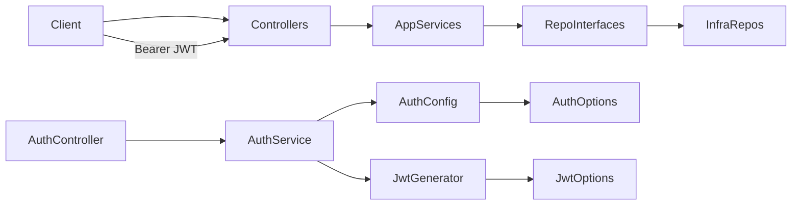

# Milestone 4 — REST API and Security

## Scope

In scope (from [docs/02-Plan.md](docs/02-Plan.md) Milestone 4 only):

- REST controllers for Categories, Products, Inventory Entries, Inventory Exits, Inventory Movements (read-only), and Login
- Global exception handling (`IExceptionHandler`), not per-controller try/catch
- JWT Bearer authentication with login using configured credentials (no external Identity Provider) per [ADR-003](docs/adr/ADR-003-Authentication-OAuth2.md)
- Swagger/OpenAPI with Bearer auth support and XML documentation enabled for all REST endpoints
- Demo seed for Categories and Products only when the database is empty
- Wire auth, authorization, Swagger, and exception handling in [Program.cs](src/Inventory.Api/Program.cs)
- Thin Application additions required by the API: `IAuthService` / `AuthService` and read-only movement queries (controllers never touch repositories)

Explicitly out of scope (Milestone 5 and beyond):

- Docker image / Compose API service wiring / end-to-end container validation
- Broad new Application unit-test suites (existing M3 tests must keep passing; minimal AuthService / movement-read tests only if useful)
- External Identity Provider, ASP.NET Identity, IdentityServer, OpenIddict, refresh tokens, roles, policies
- POST/PUT/DELETE for Inventory Movements (writes remain side effects of entry/exit only)
- MediatR, AutoMapper, UnitOfWork, API versioning, FluentValidation packages
- Users table / user persistence

Do not change ADRs, skills, or Cursor rules while executing this plan.

---

## Current state vs expected state

| Area | Current | Expected after M4 |
|------|---------|-------------------|
| API host | [Program.cs](src/Inventory.Api/Program.cs): `AddInfrastructure` + `AddApplication` + controllers only | AuthN/AuthZ, global exception handler, Swagger, seed invocation, middleware pipeline ordered correctly |
| Controllers | None | Six thin controllers delegating to Application services |
| Exceptions | [BusinessException](src/Inventory.Application/Exceptions/BusinessException.cs) / [NotFoundException](src/Inventory.Application/Exceptions/NotFoundException.cs) exist; unhandled at host | Mapped to HTTP 400 / 404 / 500 via global handler |
| Auth | No JWT packages, no login, no User entity | `IAuthConfiguration` + `JwtTokenGenerator`; `[Authorize]` on inventory endpoints; login public |
| Swagger | Not configured | OpenAPI UI with Bearer security scheme and XML docs |
| Seed | None | Idempotent demo Categories and Products only when DB empty |
| Application | Four services (Category, Product, Entry, Exit) | Same four + `IAuthService` + read-only `IInventoryMovementService` |
| Packages | EF Design only on Api | JwtBearer + Swashbuckle (+ JWT token libs as needed) |

Layer responsibilities remain per [ADR-002](docs/adr/ADR-002-Solution-Architecture.md):

| Layer | M4 responsibility |
|-------|-------------------|
| **API** | Controllers, exception handler, Swagger config (incl. XML), host pipeline |
| **Application** | Auth orchestration + DTOs; read-only movement queries; existing business services unchanged in rules |
| **Infrastructure** | JWT generation, `IAuthConfiguration` / AuthOptions, EF seed |
| **Domain** | Unchanged (no User entity) |

Hard rules:

- Controllers only talk to Application services (never repositories / `DbContext`)
- Business rules stay in Application
- AuthService depends only on Application abstractions (`IAuthConfiguration`, `IJwtTokenGenerator`) — never `IConfiguration` directly
- JWT token generation and auth config binding live in Infrastructure
- Swagger stays in API, isolated from business logic
- Global exception handling outside controllers
- No ASP.NET Identity, IdentityServer, OpenIddict, refresh tokens, roles, policies, MediatR, AutoMapper, FluentValidation, or UnitOfWork

---

## Authentication (ADR-003)

Simple implementation note:

- Configure JWT Bearer Authentication.
- Expose `POST /api/auth/login`.
- Return a JWT token after validating configured credentials.
- Protect the remaining endpoints using `[Authorize]`.
- Configure Swagger with Bearer authentication.

### Components

| Piece | Location | Role |
|-------|----------|------|
| `AuthController` | API | HTTP login endpoint (`[AllowAnonymous]`) |
| `IAuthService` / `AuthService` | Application | Compare login request to `IAuthConfiguration`; on match call `IJwtTokenGenerator`; on failure throw `BusinessException` |
| `IAuthConfiguration` | Application abstraction | Exposes configured demo username/password (no `IConfiguration` in AuthService) |
| `AuthOptions` + `AuthConfiguration` | Infrastructure | Bind `Auth` section via `IOptions<AuthOptions>`; implement `IAuthConfiguration` |
| `IJwtTokenGenerator` | Application abstraction | Token issuance contract |
| `JwtTokenGenerator` | Infrastructure | Sign and return JWT from `Jwt` / `IOptions<JwtOptions>` |

Do **not** inject `IConfiguration` into `AuthService`. Do **not** add `IDemoUserValidator`, Users table, ASP.NET Identity, IdentityServer, OpenIddict, refresh tokens, roles, or policies.

### Public vs authenticated endpoints

| Endpoint group | Auth |
|----------------|------|
| `POST /api/auth/login` | Public (`[AllowAnonymous]`) |
| Swagger UI / OpenAPI docs | Public |
| Categories, Products, Inventory Entries, Inventory Exits, Inventory Movements | Require authentication (`[Authorize]` at controller level) |

Prefer **controller `[Authorize]` + anonymous login** (no FallbackPolicy complexity).

### Swagger authentication

- Register a Bearer security scheme (`Authorization: Bearer {token}`).
- After login with demo credentials, paste the JWT in Swagger’s Authorize dialog.
- Enable Swagger XML documentation so all REST endpoints are documented.
- Keep Swagger setup in a dedicated API extension/class (no business logic).

### Demo authentication credentials

- **No Users table.** Credentials come only from configuration (`appsettings.Development.json` or environment variables).
- Document the Development defaults used for Swagger testing, for example:

```json
"Auth": {
  "Username": "demo",
  "Password": "Demo123!"
}
```

- Same values must be what `POST /api/auth/login` accepts in Development. Prefer env vars override for non-local environments; never treat these as production secrets.

---

## REST endpoint map

Aligned with [RESTAPI skill](.cursor/skills/RESTAPI/SKILL.md) and existing Application APIs.

| Method | Route | Service | Success |
|--------|-------|---------|---------|
| POST | `/api/auth/login` | `IAuthService` | 200 + token |
| GET/POST | `/api/categories` | `ICategoryService` | 200 / 201 |
| GET/PUT/DELETE | `/api/categories/{id}` | `ICategoryService` | 200 / 204 / 204 |
| GET/POST | `/api/products` | `IProductService` | 200 / 201 |
| GET/PUT/DELETE | `/api/products/{id}` | `IProductService` | 200 / 204 / 204 |
| GET | `/api/inventory/entries/{id}` | `IInventoryEntryService` | 200 |
| GET | `/api/inventory/entries?productId=` | `IInventoryEntryService` | 200 |
| POST | `/api/inventory/entries` | `IInventoryEntryService` | 201 |
| DELETE | `/api/inventory/entries/{id}` | `IInventoryEntryService` | 204 |
| GET | `/api/inventory/exits/{id}` | `IInventoryExitService` | 200 |
| GET | `/api/inventory/exits?productId=` | `IInventoryExitService` | 200 |
| POST | `/api/inventory/exits` | `IInventoryExitService` | 201 |
| DELETE | `/api/inventory/exits/{id}` | `IInventoryExitService` | 204 |
| GET | `/api/inventory/movements` | `IInventoryMovementService` | 200 |
| GET | `/api/inventory/movements/{id}` | `IInventoryMovementService` | 200 |

Controller notes:

- Null `GetById` results → `NotFound()` (HTTP concern); mutations that throw `NotFoundException`/`BusinessException` → global handler.
- No Update endpoints for entries/exits (services have none).
- **Inventory Movements are read-only:** `InventoryMovementsController` exposes only the two GET routes above. No POST, PUT, or DELETE.
- Movement **writes** remain side effects inside Entry/Exit Application flows (existing M3 design via `IInventoryMovementRepository`).
- Controller calls `IInventoryMovementService` only — never repositories.
- Add `GetAllAsync` on [IInventoryMovementRepository](src/Inventory.Application/Abstractions/Persistence/IInventoryMovementRepository.cs) (EF read) so `GET /api/inventory/movements` can list movements; keep existing `GetByIdAsync` for by-id.



---

## Files to create

**API**

- [src/Inventory.Api/Controllers/AuthController.cs](src/Inventory.Api/Controllers/AuthController.cs)
- [src/Inventory.Api/Controllers/CategoriesController.cs](src/Inventory.Api/Controllers/CategoriesController.cs)
- [src/Inventory.Api/Controllers/ProductsController.cs](src/Inventory.Api/Controllers/ProductsController.cs)
- [src/Inventory.Api/Controllers/InventoryEntriesController.cs](src/Inventory.Api/Controllers/InventoryEntriesController.cs)
- [src/Inventory.Api/Controllers/InventoryExitsController.cs](src/Inventory.Api/Controllers/InventoryExitsController.cs)
- [src/Inventory.Api/Controllers/InventoryMovementsController.cs](src/Inventory.Api/Controllers/InventoryMovementsController.cs) — GET only
- [src/Inventory.Api/ExceptionHandling/GlobalExceptionHandler.cs](src/Inventory.Api/ExceptionHandling/GlobalExceptionHandler.cs) (`IExceptionHandler`)
- [src/Inventory.Api/Swagger/SwaggerExtensions.cs](src/Inventory.Api/Swagger/SwaggerExtensions.cs) (OpenAPI + Bearer + XML docs)

**Application**

- [src/Inventory.Application/DTOs/Auth/LoginRequest.cs](src/Inventory.Application/DTOs/Auth/LoginRequest.cs)
- [src/Inventory.Application/DTOs/Auth/TokenResponse.cs](src/Inventory.Application/DTOs/Auth/TokenResponse.cs)
- [src/Inventory.Application/Abstractions/Authentication/IAuthConfiguration.cs](src/Inventory.Application/Abstractions/Authentication/IAuthConfiguration.cs)
- [src/Inventory.Application/Abstractions/Authentication/IJwtTokenGenerator.cs](src/Inventory.Application/Abstractions/Authentication/IJwtTokenGenerator.cs)
- [src/Inventory.Application/Services/Auth/IAuthService.cs](src/Inventory.Application/Services/Auth/IAuthService.cs)
- [src/Inventory.Application/Services/Auth/AuthService.cs](src/Inventory.Application/Services/Auth/AuthService.cs) — depends only on `IAuthConfiguration` + `IJwtTokenGenerator`
- [src/Inventory.Application/Services/Inventory/IInventoryMovementService.cs](src/Inventory.Application/Services/Inventory/IInventoryMovementService.cs)
- [src/Inventory.Application/Services/Inventory/InventoryMovementService.cs](src/Inventory.Application/Services/Inventory/InventoryMovementService.cs) — `GetAllAsync` / `GetByIdAsync` only; map to existing [InventoryMovementDto](src/Inventory.Application/DTOs/Inventory/InventoryMovementDto.cs)

**Infrastructure**

- [src/Inventory.Infrastructure/Authentication/JwtOptions.cs](src/Inventory.Infrastructure/Authentication/JwtOptions.cs)
- [src/Inventory.Infrastructure/Authentication/AuthOptions.cs](src/Inventory.Infrastructure/Authentication/AuthOptions.cs)
- [src/Inventory.Infrastructure/Authentication/AuthConfiguration.cs](src/Inventory.Infrastructure/Authentication/AuthConfiguration.cs) — `IAuthConfiguration` via `IOptions<AuthOptions>`
- [src/Inventory.Infrastructure/Authentication/JwtTokenGenerator.cs](src/Inventory.Infrastructure/Authentication/JwtTokenGenerator.cs)
- [src/Inventory.Infrastructure/Persistence/Seed/DemoDataSeeder.cs](src/Inventory.Infrastructure/Persistence/Seed/DemoDataSeeder.cs)

**Tests (minimal, optional)**

- [tests/Inventory.Tests/Application/AuthServiceTests.cs](tests/Inventory.Tests/Application/AuthServiceTests.cs)
- [tests/Inventory.Tests/Application/InventoryMovementServiceTests.cs](tests/Inventory.Tests/Application/InventoryMovementServiceTests.cs)

---

## Files to modify

- [src/Inventory.Api/Program.cs](src/Inventory.Api/Program.cs) — authentication, authorization, exception handler, Swagger, seed, middleware order: exception handling → HTTPS → authentication → authorization → controllers; Swagger in Development (and optionally always for this demo API)
- [src/Inventory.Api/Inventory.Api.csproj](src/Inventory.Api/Inventory.Api.csproj) — NuGet packages; enable XML documentation generation for Swagger
- [src/Inventory.Api/appsettings.json](src/Inventory.Api/appsettings.json) — `Jwt` + `Auth` sections (empty/placeholder secrets)
- [src/Inventory.Api/appsettings.Development.json](src/Inventory.Api/appsettings.Development.json) — local JWT key, issuer/audience, **documented demo credentials**
- [src/Inventory.Application/DependencyInjection.cs](src/Inventory.Application/DependencyInjection.cs) — register `IAuthService`, `IInventoryMovementService`
- [src/Inventory.Application/Abstractions/Persistence/IInventoryMovementRepository.cs](src/Inventory.Application/Abstractions/Persistence/IInventoryMovementRepository.cs) — add `GetAllAsync` for list reads
- [src/Inventory.Infrastructure/Persistence/Repositories/InventoryMovementRepository.cs](src/Inventory.Infrastructure/Persistence/Repositories/InventoryMovementRepository.cs) — EF `GetAllAsync`
- [src/Inventory.Infrastructure/DependencyInjection.cs](src/Inventory.Infrastructure/DependencyInjection.cs) — bind `AuthOptions` / `JwtOptions`; register `AuthConfiguration`, `JwtTokenGenerator`, seeder
- [src/Inventory.Infrastructure/Inventory.Infrastructure.csproj](src/Inventory.Infrastructure/Inventory.Infrastructure.csproj) — JWT-related packages if token creation lives here

---

## Project dependencies

Unchanged project graph:

```text
Inventory.Api → Application, Infrastructure
Inventory.Infrastructure → Application, Domain
Inventory.Application → Domain
Inventory.Tests → Application (+ mocks)
```

No new projects. Controllers depend only on Application service interfaces.

---

## Required NuGet packages

| Package | Project | Purpose |
|---------|---------|---------|
| `Microsoft.AspNetCore.Authentication.JwtBearer` | Api (and/or Infrastructure if auth DI extension lives there) | JWT Bearer middleware |
| `Swashbuckle.AspNetCore` | Api | Swagger UI + OpenAPI + Bearer security definition + XML comments |
| `System.IdentityModel.Tokens.Jwt` | Infrastructure | Create/sign access tokens (if not already transitive) |
| `Microsoft.Extensions.Options.ConfigurationExtensions` | Infrastructure | Bind `Jwt` / `Auth` options (usually already available) |

Do **not** add IdentityServer, OpenIddict, ASP.NET Identity, AutoMapper, FluentValidation, or MediatR.

Config keys (illustrative):

```json
"Jwt": { "Issuer": "...", "Audience": "...", "Key": "...", "ExpirationMinutes": 60 },
"Auth": { "Username": "demo", "Password": "Demo123!" }
```

`AuthService` reads credentials only through `IAuthConfiguration` (Infrastructure supplies values from `IOptions<AuthOptions>`).

---

## Implementation order

1. **Packages + configuration** — add NuGet refs; add `Jwt` / `Auth` to appsettings (document Development demo credentials; secrets only in Development / env vars).
2. **Auth stack** — `IAuthConfiguration` + `IJwtTokenGenerator` + `AuthService` (+ optional tests) → Infrastructure `AuthOptions` / `AuthConfiguration` / `JwtTokenGenerator` → `AuthController` → wire in `AddInfrastructure` / `AddApplication`.
3. **Global exception handler** — map only: `NotFoundException` → 404, `BusinessException` → 400, `Exception` → 500; register in Program.
4. **Resource controllers** — Categories, Products, Entries, Exits over existing services (thin HTTP mapping only).
5. **Movement reads** — `GetAllAsync` on movement repository → read-only `IInventoryMovementService` → `InventoryMovementsController` (GET list + GET by id only).
6. **JWT middleware + Authorize** — `AddAuthentication().AddJwtBearer(...)`, `UseAuthentication` / `UseAuthorization`, `[Authorize]` on inventory controllers, `[AllowAnonymous]` on login.
7. **Swagger** — isolated extension: SwaggerGen + Bearer scheme + UI + **XML documentation** enabled; ensure login remains callable without a token.
8. **Demo seed** — `DemoDataSeeder` (EF): if no categories/products, insert a small fixed Categories + Products set only; do **not** seed entries, exits, or movements; invoke once at startup after DI build (scoped resolve).
9. **Validate** — build, test, smoke via Swagger (login with demo credentials → CRUD → entry/exit stock checks → movement GETs).

---

## Risks

| Risk | Mitigation |
|------|------------|
| Demo password in config | Document Development-only defaults; prefer env vars for real deploys; no Users table |
| Seed races / duplicate data | Seed Categories/Products only when empty; no `HasData` migration coupling |
| GetById null vs NotFoundException inconsistency | Controllers handle null → 404; mutations keep throwing; handler covers throws |
| Jwt key too short / missing | Validate options at startup; clear exception if Key/Issuer/Audience missing |
| Middleware order mistakes | Follow: exception handler → HTTPS → Swagger → Authentication → Authorization → MapControllers |

---

## Validation steps

1. `dotnet build` on the solution succeeds.
2. `dotnet test` — all existing M3 Application tests pass; Auth/movement-read tests pass if added.
3. Run API against local SQL Server (existing Docker DB from M2).
4. Open Swagger: login without token succeeds using documented demo credentials; inventory calls without token return **401**.
5. Authorize in Swagger with returned JWT; Categories/Products CRUD works.
6. Create entry via API: confirm `Product.Stock` **increases** by the entry quantity (GET product before and after).
7. Create exit via API: confirm `Product.Stock` **decreases** by the exit quantity (GET product before and after).
8. After entry/exit, `GET /api/inventory/movements` and `GET /api/inventory/movements/{id}` return the side-effect movement rows (no create/update/delete movement APIs).
9. Trigger business rule (e.g. exit with insufficient stock) → **400** with message, not 500.
10. GET unknown id → **404**.
11. Restart API with seeded DB → seed does not duplicate Categories/Products; no seeded entries/exits/movements.
12. Confirm controllers reference only Application services (no repository/`DbContext` usings).
13. Confirm Swagger UI shows XML documentation for all REST endpoints.

---

## Definition of Done

- All Milestone 4 scope items from [docs/02-Plan.md](docs/02-Plan.md) are implemented.
- Controllers are thin and only call Application services.
- Global exception handling is outside controllers and maps: `NotFoundException` → 404, `BusinessException` → 400, `Exception` → 500.
- Login issues JWTs after validating configured credentials via `IAuthConfiguration`; JWT Bearer protects Categories, Products, Entries, Exits, Movements; Login and Swagger stay public.
- Swagger documents and authenticates with Bearer tokens.
- **Swagger XML documentation is enabled and all REST endpoints are documented.**
- Demo data seeds Categories and Products only, idempotently when empty; demo Auth credentials are documented in Development config (no Users table).
- Inventory Movements expose read-only GET endpoints only; writes remain entry/exit side effects.
- AuthService depends only on abstractions (`IAuthConfiguration`, `IJwtTokenGenerator`).
- Solution builds; existing tests pass.
- No Milestone 5 deliverables (Docker image/Compose API full-flow) included.
- Architecture matches ADR-001 / ADR-002 / ADR-003 and Cursor backend rules; no unnecessary enterprise abstractions.
