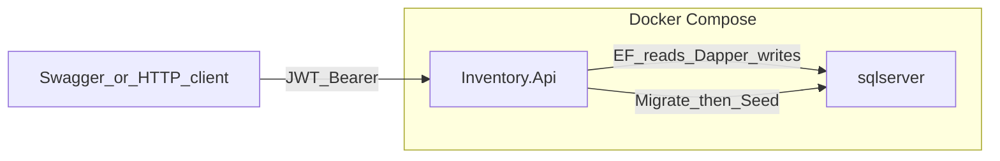

# Milestone 5 — Testing and Final Validation

## Scope

In scope (from [docs/02-Plan.md](docs/02-Plan.md) Milestone 5 only):

- Review Application/Domain unit coverage and add **minimal** missing business-rule tests
- Create API `Dockerfile` and extend Compose so API + SQL Server run together
- Validate the complete application flow (build, tests, containers, Swagger E2E)
- Produce a final architecture and code quality review (analysis + recommendations only)
- Create/update the **root** project [README.md](README.md)

Explicitly out of scope:

- New business features, REST endpoints, auth/authorization changes
- Domain / Application / Infrastructure / API architectural redesign or new patterns/abstractions/frameworks
- Database schema or migration **file** changes
- CI/CD, Kubernetes, cloud deploy, monitoring, caching, messaging, observability
- Controller/integration/E2E automated test projects
- Changes to ADRs, Cursor rules, or skills

Hard rules:

- Do not redesign architecture; review may recommend only—implement a fix only if a **critical** blocker for Docker/run validation is found
- Controllers remain thin; no `DbContext` in controllers
- Connection strings and secrets via env / `appsettings` only (Docker skill)
- SQL Server stays a separate Compose service; API connects by **service name** `sqlserver`
- Persist SQL data with the existing volume

**Chosen defaults (locked):**

1. **Unit tests:** fill business-rule gaps only (~6–8 Application tests); skip thin read-mapping tests
2. **Schema in containers:** apply **existing** EF migrations at API startup (before demo seed)—host bootstrap only, same style as existing seed in [Program.cs](src/Inventory.Api/Program.cs); no migration redesign
3. **Review artifact:** [docs/03-Architecture-Review.md](docs/03-Architecture-Review.md) (recommendations; no drive-by refactors)
4. **README:** new root [README.md](README.md); leave [docs/README_AI.md](docs/README_AI.md) as the AI guide

---

## Current state vs expected state

| Area | Current | Expected after M5 |
|------|---------|-------------------|
| Unit tests | Strong Domain + Application coverage; gaps on `ProductService.UpdateAsync` validations, `CategoryService` empty-name update, entry-delete stock reverse failure | Those business rules covered; `dotnet test` green |
| Docker image | No `Dockerfile`; [.dockerignore](.dockerignore) already prepared | Multi-stage .NET 10 image builds and runs `Inventory.Api` |
| Compose | [docker-compose.yml](docker-compose.yml): SQL Server only | `api` + `sqlserver`; API waits on healthy SQL; env-driven config |
| Env sample | [.env.example](.env.example): `MSSQL_SA_PASSWORD` only | Also documents JWT/Auth/connection vars used by Compose API |
| Startup DB | Seed runs; **migrations not applied at runtime** | Pending migrations applied once before seed (critical for first container boot) |
| Full flow | Local: Compose SQL + host `dotnet run` + manual `ef database update` | Documented + validated: `docker compose up --build` → Swagger login → CRUD/stock → 401/400/404 |
| Architecture review | None | [docs/03-Architecture-Review.md](docs/03-Architecture-Review.md) against ADRs/rules |
| README | No root README | Root README with install, config, Docker, Swagger, demo credentials, architecture, tests |

---

## Files to create

| File | Purpose |
|------|---------|
| [Dockerfile](Dockerfile) | Multi-stage build (`sdk` → `aspnet`) publishing `Inventory.Api`; expose 8080 |
| [README.md](README.md) | Project install/config/Docker/Swagger/demo creds/architecture/tests |
| [docs/03-Architecture-Review.md](docs/03-Architecture-Review.md) | Final architecture and code quality review |

---

## Files to modify

| File | Change |
|------|--------|
| [docker-compose.yml](docker-compose.yml) | Add `api` service: build `.`, `depends_on` SQL healthy, port `8080:8080`, env for `ConnectionStrings__InventoryDb` (`Server=sqlserver,...`), `Jwt__*`, `Auth__*`, `ASPNETCORE_ENVIRONMENT` |
| [.env.example](.env.example) | Document Compose/API vars (password, JWT key/issuer/audience, demo Auth username/password)—no secrets committed |
| [src/Inventory.Api/Program.cs](src/Inventory.Api/Program.cs) | Before seed: resolve `InventoryDbContext`, `Database.MigrateAsync()`; keep existing seed call |
| [tests/Inventory.Tests/Application/ProductServiceTests.cs](tests/Inventory.Tests/Application/ProductServiceTests.cs) | Update validation + happy path; delete-not-found |
| [tests/Inventory.Tests/Application/CategoryServiceTests.cs](tests/Inventory.Tests/Application/CategoryServiceTests.cs) | Empty-name update → `BusinessException` |
| [tests/Inventory.Tests/Application/InventoryEntryServiceTests.cs](tests/Inventory.Tests/Application/InventoryEntryServiceTests.cs) | Delete when stock insufficient to reverse → `BusinessException` |
| [.dockerignore](.dockerignore) | Only if needed (e.g. exclude `.cursor/`, `docs/` build noise)—keep lean |

**Do not modify:** Domain entities, Application business rules (except tests), repositories, controllers, auth stack, Swagger behavior, migration classes, ADRs/skills/rules.

---

## Project dependencies

- **No new projects** and **no new project references**
- Existing graph unchanged: Api → Application + Infrastructure; Tests → Application + Domain; Infrastructure → Application + Domain

---

## NuGet packages

- **No new NuGet packages**
- Keep existing test stack: xUnit, Moq, FluentAssertions ([tests/Inventory.Tests/Inventory.Tests.csproj](tests/Inventory.Tests/Inventory.Tests.csproj))
- Keep existing API packages: JwtBearer, Swashbuckle, EF Design ([src/Inventory.Api/Inventory.Api.csproj](src/Inventory.Api/Inventory.Api.csproj))

---

## Implementation order

1. **Unit test gap-fill (TDD-friendly)**  
   Add only:
   - `InventoryEntryServiceTests`: `DeleteAsync_throws_BusinessException_when_stock_insufficient_to_reverse`
   - `CategoryServiceTests`: `UpdateAsync_throws_BusinessException_when_name_empty`
   - `ProductServiceTests`: update empty name; negative stock; negative unit price; category missing; happy update; delete product missing  
   Match existing Moq/FluentAssertions style. Run `dotnet test`.

2. **API startup migrate-before-seed**  
   In [Program.cs](src/Inventory.Api/Program.cs), apply pending migrations via scoped `InventoryDbContext` immediately before `SeedDemoDataAsync`. This is the only host change required so Compose first-boot works without host-side `dotnet ef`.

3. **Dockerfile**  
   Multi-stage:
   - `mcr.microsoft.com/dotnet/sdk:10.0` — restore/publish `src/Inventory.Api/Inventory.Api.csproj`
   - `mcr.microsoft.com/dotnet/aspnet:10.0` — copy publish output, `ENTRYPOINT` dll, `ASPNETCORE_URLS=http://+:8080`  
   Align with existing [.dockerignore](.dockerignore).

4. **Docker Compose + env**  
   Extend [docker-compose.yml](docker-compose.yml) with `api` service per Docker skill (env vars, service name `sqlserver`, volume unchanged). Expand [.env.example](.env.example). Keep `sqlserver` healthcheck; `api` `depends_on: condition: service_healthy`.

5. **Validate complete flow** (manual checklist below).

6. **Architecture / code quality review**  
   Write [docs/03-Architecture-Review.md](docs/03-Architecture-Review.md) covering:
   - ADR-001 CQRS (EF reads / Dapper writes)
   - ADR-002 layer boundaries and dependency direction
   - ADR-003 JWT Bearer; login public; inventory endpoints protected
   - Cursor rules: async naming, no DbContext in controllers, business rules in Application
   - Test coverage adequacy after gap-fill
   - Docker skill compliance  
   Output: findings + **recommendations only**. No refactors in M5 unless a critical blocker is discovered during validation.

7. **Root README**  
   Document:
   - Prerequisites (.NET 10 SDK, Docker Desktop)
   - Installation / restore / build
   - Configuration (`ConnectionStrings:InventoryDb`, `Jwt`, `Auth`; env var equivalents)
   - Docker: copy `.env.example` → `.env`, `docker compose up --build`
   - Local non-Docker API run (SQL via Compose, optional `dotnet ef database update` if not using migrate-at-startup path yet)
   - Swagger: `/swagger`, Authorize with Bearer token from `POST /api/auth/login`
   - Demo credentials (`demo` / `Demo123!` from Development config / Compose env)
   - Architecture overview (four layers + Tests; CQRS split)
   - How to run tests: `dotnet test`

---

## Risks

| Risk | Mitigation |
|------|------------|
| SQL not ready when API starts | Keep healthcheck; `depends_on` healthy; Migrate/Seed after listen may still race—retry or short delay only if validation fails (no new frameworks) |
| mssql-tools18 path/healthcheck fragility (existing) | Reuse current healthcheck; if broken on host Docker, fix command only—do not redesign Compose topology |
| JWT/Auth empty in container | Pass all required env vars from `.env` / Compose; fail-fast already exists in Infrastructure DI |
| Treating review findings as mandatory work | Review is advisory; only fix critical run blockers in M5 |
| Accidental scope creep (new endpoints, CI, observability) | Stick to file list above |

---

## Validation steps

1. `dotnet build Inventory.sln` — success, warnings-as-errors clean  
2. `dotnet test` — all Domain/Application tests pass including new ones  
3. Copy `.env.example` → `.env`; `docker compose up --build -d` — both containers healthy/running  
4. Open `http://localhost:8080/swagger`  
5. Flow: login → create/list category & product → entry increases stock → exit decreases stock → movements list → delete guards (400) → missing resource (404) → no token (401)  
6. Confirm demo seed Categories/Products when DB empty  
7. Architecture review doc completed and consistent with ADRs  
8. README steps verified end-to-end on a clean Compose stack  

---

## Definition of Done

- [ ] Application business-rule test gaps closed; full test suite green  
- [ ] `Dockerfile` builds a runnable API image  
- [ ] `docker-compose.yml` runs API + SQL Server with env-based config and persisted volume  
- [ ] Pending migrations apply at startup before seed (existing migrations only)  
- [ ] Complete Swagger-authenticated inventory flow validated in containers  
- [ ] [docs/03-Architecture-Review.md](docs/03-Architecture-Review.md) written (analysis + recommendations; no non-critical refactors)  
- [ ] Root [README.md](README.md) documents install, configuration, Docker, Swagger, demo credentials, architecture, and tests  
- [ ] No new endpoints, auth changes, schema/migration redesign, or new frameworks/patterns  
- [ ] ADRs, Cursor rules, and skills unchanged and respected  
