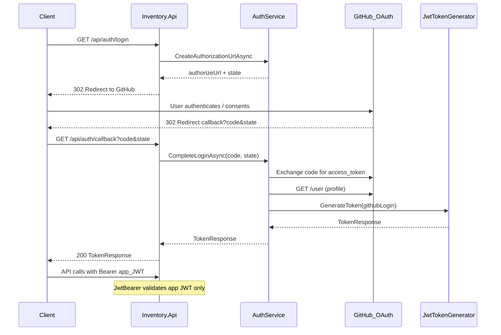

# Migration Plan — Demo JWT Login → GitHub OAuth2 (Hybrid)

## Scope

### In scope

- Replace `POST /api/auth/login` (demo username/password) with GitHub OAuth2 **Authorization Code** flow.
- Register/configure the API as a **confidential OAuth2 Client** against GitHub.
- After successful GitHub authentication, **issue the existing application JWT** via [`JwtTokenGenerator`](src/Inventory.Infrastructure/Authentication/JwtTokenGenerator.cs).
- Keep JWT Bearer validation for protected inventory endpoints **unchanged in behavior** (symmetric key, Issuer, Audience from `Jwt:*`).
- Remove demo credential configuration (`Auth:Username` / `Auth:Password`).
- Update unit tests, Docker/env docs, and [ADR-003](docs/adr/ADR-003-Authentication-OAuth2.md) to reflect the new login path.
- Preserve Clean Architecture, thin controllers, Application-layer business rules.

### Out of scope

- ASP.NET Identity, IdentityServer, OpenIddict, Duende.
- Users table / any user persistence / EF migrations for identity.
- Authorizing API requests with GitHub access tokens.
- Refresh tokens, roles, policies, multi-IdP, account linking.
- Redesign of Categories/Products/Entries/Exits/Movements.
- Changing CQRS (EF reads / Dapper writes) or Domain model.

---

## Current state vs expected state

| Area | Current | Expected |
|------|---------|----------|
| Login | `POST /api/auth/login` with username/password from `Auth:*` | `GET /api/auth/login` redirects to GitHub; `GET /api/auth/callback` completes flow |
| Identity proof | Compare request to configured demo credentials | Exchange GitHub `code` → GitHub user profile (login/id) |
| Token issued | App JWT via `IJwtTokenGenerator` | Same: app JWT via `IJwtTokenGenerator` (subject = GitHub login) |
| API authorization | Validate app JWT (`JwtBearer` + `Jwt:Key`) | Unchanged: validate **only** app JWT |
| GitHub token | N/A | Used **only** server-side during callback to fetch profile; never accepted as `Authorization` bearer for inventory APIs |
| User store | None (config credentials) | None (ephemeral GitHub identity → JWT claims only) |
| Swagger | Paste JWT from demo login | Paste JWT returned after GitHub callback (Bearer scheme unchanged) |



---

## Required architecture changes

### Roles

- **GitHub**: External Authorization Server / IdP (authentication only).
- **API**: OAuth2 **Client** (Authorization Code) for login + **Resource Server** for app JWTs.
- **API**: Continues to act as the issuer of its **own** JWTs (existing local signing). This is intentional per requirements; GitHub tokens are not API credentials.

### Layer responsibilities

| Layer | Responsibility |
|-------|----------------|
| **API** | Thin `AuthController`: start redirect; accept callback query params; return `TokenResponse`. No HTTP calls to GitHub. |
| **Application** | `IAuthService`: build authorize URL, validate `state`, orchestrate code exchange + profile fetch via abstractions, map identity to JWT subject, throw `BusinessException` on invalid/missing code/state or GitHub failures. |
| **Infrastructure** | `IGitHubOAuthClient` implementation (`HttpClient`), `GitHubOptions`, in-memory (or distributed) OAuth `state` store, existing `JwtTokenGenerator` + `JwtBearer` setup. |
| **Domain** | Unchanged. |

### Design choices (fixed)

1. **Manual OAuth2 Client** over ASP.NET `AddOAuth("GitHub")` cookie middleware: the API must return JSON `TokenResponse`, not establish a cookie session. Keeps controllers thin and avoids cookie/Data Protection complexity for a JWT API.
2. **Keep `JwtTokenGenerator` and `Jwt:*` config** as the sole API credential mechanism.
3. **No user persistence**: GitHub `login` (and optionally numeric `id` as an extra claim) is embedded in the JWT only.
4. **CSRF `state`**: generated on login start, stored temporarily, validated on callback (Application rule + Infrastructure store).
5. **Do not** register GitHub access tokens with `JwtBearer` or any secondary authentication scheme for inventory endpoints.

### ADR / skill impact

- Update [ADR-003](docs/adr/ADR-003-Authentication-OAuth2.md): login via GitHub OAuth2 Client; API JWT remains the bearer for protected endpoints; Login endpoints stay public; Swagger stays public.
- Align [.cursor/skills/Authentication/SKILL.md](.cursor/skills/Authentication/SKILL.md): allow anonymous login/callback; generate signed app JWTs after external auth; never expose client secrets.

---

## Files to create

| File | Purpose |
|------|---------|
| `src/Inventory.Application/Abstractions/Authentication/IGitHubOAuthClient.cs` | Exchange authorization code; fetch GitHub user profile |
| `src/Inventory.Application/Abstractions/Authentication/IOauthStateStore.cs` | Store/validate one-time OAuth `state` values |
| `src/Inventory.Application/DTOs/Auth/GitHubUserInfo.cs` | Profile DTO (`Id`, `Login`) returned by client abstraction |
| `src/Inventory.Infrastructure/Authentication/GitHubOptions.cs` | `ClientId`, `ClientSecret`, `RedirectUri`, `Scopes`, authorize/token/user URLs |
| `src/Inventory.Infrastructure/Authentication/GitHubOAuthClient.cs` | `HttpClient` calls to `https://github.com/login/oauth/access_token` and `https://api.github.com/user` |
| `src/Inventory.Infrastructure/Authentication/InMemoryOauthStateStore.cs` | Short-TTL in-memory state (sufficient for single-instance / local Docker) |

Optional (only if JSON response shaping for browser is desired later; default is JSON `TokenResponse` from callback):

- None required for MVP.

---

## Files to modify

| File | Change |
|------|--------|
| [`src/Inventory.Api/Controllers/AuthController.cs`](src/Inventory.Api/Controllers/AuthController.cs) | Replace `POST login` with `GET login` (redirect) + `GET callback` (return token) |
| [`src/Inventory.Application/Services/Auth/IAuthService.cs`](src/Inventory.Application/Services/Auth/IAuthService.cs) | Replace `LoginAsync(LoginRequest)` with `GetAuthorizationUrlAsync` + `CompleteLoginAsync(code, state)` |
| [`src/Inventory.Application/Services/Auth/AuthService.cs`](src/Inventory.Application/Services/Auth/AuthService.cs) | Orchestrate GitHub OAuth + `IJwtTokenGenerator`; remove credential comparison |
| [`src/Inventory.Application/DependencyInjection.cs`](src/Inventory.Application/DependencyInjection.cs) | Keep `IAuthService` registration (signature changes only) |
| [`src/Inventory.Infrastructure/DependencyInjection.cs`](src/Inventory.Infrastructure/DependencyInjection.cs) | Bind `GitHubOptions`; register `HttpClient` + `IGitHubOAuthClient` + state store; **remove** `AuthOptions` / `IAuthConfiguration`; keep JwtBearer as-is |
| [`src/Inventory.Api/appsettings.json`](src/Inventory.Api/appsettings.json) | Replace `Auth` section with `GitHub` section placeholders |
| [`src/Inventory.Api/appsettings.Development.json`](src/Inventory.Api/appsettings.Development.json) | Remove demo credentials; add empty/local GitHub placeholders (no real secrets committed) |
| [`src/Inventory.Api/Swagger/SwaggerExtensions.cs`](src/Inventory.Api/Swagger/SwaggerExtensions.cs) | Update description: obtain JWT via GitHub login/callback |
| [`docker-compose.yml`](docker-compose.yml) | Replace `Auth__*` with `GitHub__ClientId`, `GitHub__ClientSecret`, `GitHub__RedirectUri` |
| [`.env.example`](.env.example) | Document GitHub OAuth app vars; remove `AUTH_USERNAME` / `AUTH_PASSWORD` |
| [`README.md`](README.md) | Document GitHub OAuth setup + JWT usage |
| [`docs/adr/ADR-003-Authentication-OAuth2.md`](docs/adr/ADR-003-Authentication-OAuth2.md) | Accepted decision update for GitHub Client + app JWT |
| [`tests/Inventory.Tests/Application/AuthServiceTests.cs`](tests/Inventory.Tests/Application/AuthServiceTests.cs) | Cover success path, invalid state, missing code, GitHub client failures |

### Files to delete

| File | Reason |
|------|--------|
| [`src/Inventory.Application/DTOs/Auth/LoginRequest.cs`](src/Inventory.Application/DTOs/Auth/LoginRequest.cs) | Demo credentials DTO no longer used |
| [`src/Inventory.Application/Abstractions/Authentication/IAuthConfiguration.cs`](src/Inventory.Application/Abstractions/Authentication/IAuthConfiguration.cs) | Demo credentials abstraction |
| [`src/Inventory.Infrastructure/Authentication/AuthOptions.cs`](src/Inventory.Infrastructure/Authentication/AuthOptions.cs) | Demo options |
| [`src/Inventory.Infrastructure/Authentication/AuthConfiguration.cs`](src/Inventory.Infrastructure/Authentication/AuthConfiguration.cs) | Demo implementation |

### Files to keep unchanged (behavior)

- [`JwtTokenGenerator.cs`](src/Inventory.Infrastructure/Authentication/JwtTokenGenerator.cs), [`JwtOptions.cs`](src/Inventory.Infrastructure/Authentication/JwtOptions.cs), [`TokenResponse.cs`](src/Inventory.Application/DTOs/Auth/TokenResponse.cs), [`IJwtTokenGenerator.cs`](src/Inventory.Application/Abstractions/Authentication/IJwtTokenGenerator.cs)
- All inventory controllers (`[Authorize]` remains)
- Domain / repositories / CQRS paths

---

## Required NuGet packages

| Package | Project | Purpose |
|---------|---------|---------|
| *(none new required)* | — | Use existing `HttpClient` / `IHttpClientFactory` for GitHub token + user endpoints |
| `Microsoft.Extensions.Http` | Infrastructure (if not already transitively available) | `AddHttpClient<IGitHubOAuthClient, GitHubOAuthClient>()` |

**Do not add:**

- `Microsoft.AspNetCore.Identity.*`
- `AspNet.Security.OAuth.GitHub` (cookie-oriented; conflicts with “return app JWT” API style)
- `Microsoft.Identity.Web` / Entra packages

**Keep:**

- `Microsoft.AspNetCore.Authentication.JwtBearer`
- `System.IdentityModel.Tokens.Jwt`

---

## Configuration changes

### New section `GitHub`

```json
"GitHub": {
  "ClientId": "",
  "ClientSecret": "",
  "RedirectUri": "https://localhost:7xxx/api/auth/callback",
  "Scope": "read:user",
  "AuthorizeUrl": "https://github.com/login/oauth/authorize",
  "TokenUrl": "https://github.com/login/oauth/access_token",
  "UserApiUrl": "https://api.github.com/user"
}
```

### Environment / Compose

| Config | Env var |
|--------|---------|
| `GitHub:ClientId` | `GitHub__ClientId` / `GITHUB_CLIENT_ID` |
| `GitHub:ClientSecret` | `GitHub__ClientSecret` / `GITHUB_CLIENT_SECRET` |
| `GitHub:RedirectUri` | `GitHub__RedirectUri` / `GITHUB_REDIRECT_URI` |

### Unchanged

- `Jwt:Issuer`, `Jwt:Audience`, `Jwt:Key`, `Jwt:ExpirationMinutes` (and existing fail-fast validation for key length).

### Removed

- `Auth:Username`, `Auth:Password`, `Auth__*`, `AUTH_USERNAME`, `AUTH_PASSWORD`.

### GitHub App setup (ops, not code)

1. Create a GitHub OAuth App (Settings → Developer settings).
2. Set Authorization callback URL to the API `RedirectUri` (local HTTPS or `http://localhost:8080/api/auth/callback` for Compose).
3. Place Client ID/Secret in user secrets / `.env` (never commit secrets).

### Fail-fast DI

On startup, require non-empty `GitHub:ClientId`, `ClientSecret`, and `RedirectUri` (same style as current Jwt validation).

---

## Authentication flow

1. **Start** — Client calls `GET /api/auth/login` (`[AllowAnonymous]`).
2. **State** — `AuthService` generates a cryptographically random `state`, stores it with short TTL via `IOauthStateStore`.
3. **Redirect** — Controller returns `302` to GitHub authorize URL with `client_id`, `redirect_uri`, `scope=read:user`, `state`.
4. **GitHub** — User signs in and consents.
5. **Callback** — GitHub redirects to `GET /api/auth/callback?code=...&state=...`.
6. **Validate state** — Application consumes/validates `state` (one-time); invalid → `BusinessException` → 400.
7. **Token exchange** — Infrastructure posts `code` + `client_id` + `client_secret` + `redirect_uri` to GitHub token endpoint (`Accept: application/json`).
8. **Profile** — Infrastructure calls GitHub User API with the **GitHub** access token; maps `id` + `login`.
9. **Discard GitHub token** — Do not store it; do not return it to the client.
10. **Issue app JWT** — `jwtTokenGenerator.GenerateToken(login)` (existing claims: `sub`, `unique_name`, `jti`).
11. **Response** — `200 OK` + existing `TokenResponse` (`AccessToken`, `TokenType=Bearer`, `ExpiresInMinutes`).
12. **API usage** — Client sends `Authorization: Bearer {app_jwt}` to inventory endpoints; middleware validates with `Jwt:Key` / Issuer / Audience only.

Public endpoints remain: auth login, auth callback, Swagger.

---

## Risks

| Risk | Mitigation |
|------|------------|
| In-memory `state` store breaks with multiple API replicas | Document single-instance assumption; swap `IOauthStateStore` for Redis/IDistributedCache later if scaled |
| Callback returns JSON in browser address bar UX | Acceptable for API/Swagger; document copy-token step; optional future HTML landing page (out of scope) |
| Redirect URI mismatch with GitHub App | Fail-fast config + document exact callback URL for local vs Docker ports |
| Leaking GitHub client secret | Env/user-secrets only; never log secret or GitHub access token |
| Treating GitHub token as API auth by mistake | Single `JwtBearer` scheme; no GitHub token validation handler |
| ADR/skill drift (“OAuth2”) vs local JWT issuer | Update ADR-003 Notes explicitly: GitHub for login, app JWT for API authorization |
| State fixation / CSRF | One-time state with TTL; reject missing/unknown/reused state |
| GitHub API rate limits / outages | Map to `BusinessException` with clear message; no silent demo fallback |
| Existing clients using `POST /api/auth/login` | Breaking change; document migration in README |

---

## Validation steps

1. **Build** — `dotnet build` succeeds; nullable/warnings-as-errors clean.
2. **Unit tests** — `AuthServiceTests`:
   - Happy path: valid state + GitHub profile → `GenerateToken` called with GitHub login → `TokenResponse` returned.
   - Invalid/missing `state` → `BusinessException`.
   - Missing `code` → `BusinessException`.
   - GitHub client throws/returns failure → `BusinessException`.
   - Verify GitHub access token is never present in `TokenResponse`.
3. **Manual E2E**
   - Configure real GitHub OAuth App + local Redirect URI.
   - Open `GET /api/auth/login` → GitHub → callback returns app JWT JSON.
   - Authorize in Swagger with that JWT → Categories/Products CRUD succeeds.
   - Call protected endpoint without token → 401.
   - Call with a fabricated GitHub access token as Bearer → 401 (app JwtBearer must reject it).
4. **Regression** — Existing Application/Domain inventory tests still pass.
5. **Compose** — API starts with `GitHub__*` and `Jwt__*` set; no `Auth__*` required.
6. **Secrets** — Confirm `.env` / secrets not committed; `.env.example` has placeholders only.

---

## Definition of Done

- [ ] Demo username/password login removed (endpoints, options, abstractions, tests, Compose/env docs).
- [ ] GitHub Authorization Code login + callback implemented; API acts as OAuth2 Client for authentication only.
- [ ] Successful callback returns app JWT from existing `JwtTokenGenerator` / `TokenResponse`.
- [ ] Protected endpoints authorize **only** via application JWT Bearer (unchanged validation parameters).
- [ ] GitHub access tokens are never used to authorize inventory API requests and are not returned to clients.
- [ ] No ASP.NET Identity; no Users table; no user persistence; no Domain changes.
- [ ] Controllers remain thin; GitHub HTTP I/O and JWT signing stay in Infrastructure; orchestration/rules in Application.
- [ ] Clean Architecture dependency direction preserved.
- [ ] ADR-003, README, `.env.example`, Swagger description updated.
- [ ] Unit tests rewritten and passing; manual GitHub → JWT → authorized API path verified.
- [ ] Solution builds with existing quality gates (warnings as errors).

---

## Suggested implementation order (when executing)

1. Application abstractions + `AuthService` rewrite + failing tests (TDD).
2. Infrastructure `GitHubOAuthClient` + options + state store; DI wiring; remove demo auth types.
3. `AuthController` endpoint swap.
4. Config / Compose / docs / ADR.
5. Validation checklist above.
`)
