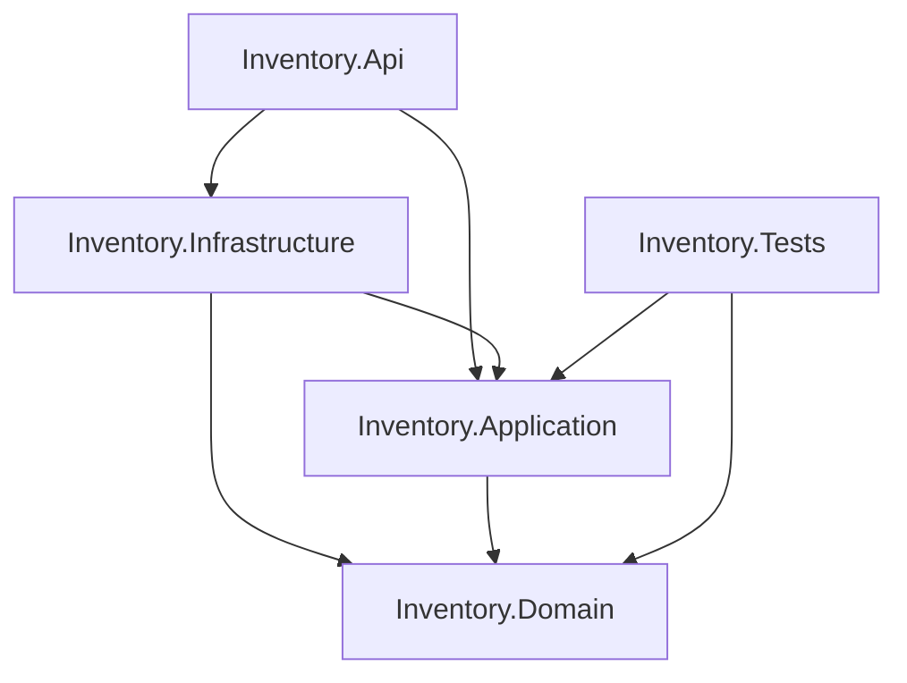

# Phase 1 — Project Foundation

## Scope mapping

Phase 1 maps to **Milestone 1** in `[docs/02-Plan.md](docs/02-Plan.md)`:


| Milestone 1 item                         | Status / action                                                                                                          |
| ---------------------------------------- | ------------------------------------------------------------------------------------------------------------------------ |
| Create solution and layered architecture | **Implement**                                                                                                            |
| Configure project dependencies           | **Implement** (project references + baseline packages)                                                                   |
| Configure Cursor rules, skills, ADRs     | **Already done** — do not recreate                                                                                       |
| Define coding standards / guidelines     | **Already done** in docs + `[.cursor/rules/backend.mdc](.cursor/rules/backend.mdc)`; enforce via `Directory.Build.props` |


**Explicitly out of scope** (later milestones):

- Milestone 2: entities, EF Core, Dapper, SQL schema, migrations, Docker/SQL
- Milestone 3: DTOs, application services, business rules
- Milestone 4: REST endpoints, OAuth2/JWT, Swagger auth, exception middleware, seed data
- Milestone 5: real unit tests, Docker image/compose validation

---

## Current state

The repository contains only documentation and Cursor guidance:

- Docs: `[docs/01-Understanding.md](docs/01-Understanding.md)`, `[docs/02-Plan.md](docs/02-Plan.md)`, `[docs/README_AI.md](docs/README_AI.md)`, ADRs under `[docs/adr/](docs/adr/)`
- Cursor: `[.cursor/rules/backend.mdc](.cursor/rules/backend.mdc)`, skills under `[.cursor/skills/](.cursor/skills/)`
- **No** `.sln`, `.csproj`, C# source, Docker, SQL, or `appsettings`
- SDKs available locally: **.NET 9** and **.NET 10** (`10.0.302`) — target `net10.0`

---

## Target solution layout

Follow naming and dependency rules from [ADR-002](docs/adr/ADR-002-Solution-Architecture.md):

```text
RedArbor.Inventory.AI/
├── Inventory.sln
├── .gitignore
├── Directory.Build.props
├── src/
│   ├── Inventory.Api/
│   ├── Inventory.Application/
│   ├── Inventory.Domain/
│   └── Inventory.Infrastructure/
└── tests/
    └── Inventory.Tests/
```




**Dependency rules (ADR-002):**

- Domain: no project references
- Application → Domain
- Infrastructure → Application, Domain
- Api → Application, Infrastructure
- Tests → Application (and Domain as needed for compile-time types later)

---

## Files to create

### Solution / build


| File                                             | Purpose                                                                                           |
| ------------------------------------------------ | ------------------------------------------------------------------------------------------------- |
| `[Inventory.sln](Inventory.sln)`                 | Solution containing all five projects                                                             |
| `[.gitignore](.gitignore)`                       | Standard .NET ignore (`bin/`, `obj/`, `.vs/`, user secrets, etc.)                                 |
| `[Directory.Build.props](Directory.Build.props)` | Shared: `net10.0`, nullable enabled, `TreatWarningsAsErrors`, implicit usings, LangVersion latest |


### `src/Inventory.Domain`


| File                                            | Purpose                                              |
| ----------------------------------------------- | ---------------------------------------------------- |
| `Inventory.Domain.csproj`                       | Class library, no NuGet packages                     |
| `Class1.cs` **deleted** / no placeholder entity | Keep project empty of domain types until Milestone 2 |


empty project with no dummy types. Folders will be created when the first implementation requires them

### `src/Inventory.Application`


| File                           | Purpose                                    |
| ------------------------------ | ------------------------------------------ |
| `Inventory.Application.csproj` | Class library; `ProjectReference` → Domain |
| No services/DTOs yet           | Milestone 3                                |


Optional empty folders: `Interfaces/`, `DTOs/`, `Services/` — same guidance as Domain.

### `src/Inventory.Infrastructure`


| File                              | Purpose                                  |
| --------------------------------- | ---------------------------------------- |
| `Inventory.Infrastructure.csproj` | Class library; refs Application + Domain |
| No EF/Dapper/Auth yet             | Milestone 2 / 4                          |


Optional empty folders: `Persistence/`, `Repositories/` — structure only.

### `src/Inventory.Api`


| File                                                | Purpose                                                                                                                                                                             |
| --------------------------------------------------- | ----------------------------------------------------------------------------------------------------------------------------------------------------------------------------------- |
| `Inventory.Api.csproj`                              | `Microsoft.NET.Sdk.Web`; refs Application + Infrastructure                                                                                                                          |
| `Program.cs`                                        | Minimal host: `WebApplication.CreateBuilder`, `MapControllers,` The API must be runnable. or empty pipeline, `app.Run()` — no auth, no DbContext registration, No placeholder code. |
| `appsettings.json` / `appsettings.Development.json` | Minimal logging + empty `ConnectionStrings` / placeholder sections only if needed for compile; **no JWT secrets hardcoded**                                                         |
| `Properties/launchSettings.json`                    | Local HTTP/HTTPS profiles                                                                                                                                                           |
| Controllers: none yet                               | Milestone 4                                                                                                                                                                         |


### `tests/Inventory.Tests`


| File                                            | Purpose                                                                                                                             |
| ----------------------------------------------- | ----------------------------------------------------------------------------------------------------------------------------------- |
| `Inventory.Tests.csproj`                        | xUnit test project; refs Application (+ Domain)                                                                                     |
| One smoke test e.g. `ArchitectureSmokeTests.cs` | Asserts solution compiles / placeholder `true` or a trivial Domain/Application assembly load — **not** business tests (Milestone 5) |


---

## Files to modify

**None of the existing documentation, ADRs, rules, or skills should be changed** for Phase 1. They already define architecture and standards.

If implementation reveals a doc typo later, update in a separate docs-only change — not required for foundation.

---

## Dependencies

### Project references (required)

```text
Inventory.Application     → Inventory.Domain
Inventory.Infrastructure  → Inventory.Application, Inventory.Domain
Inventory.Api             → Inventory.Application, Inventory.Infrastructure
Inventory.Tests           → Inventory.Application, Inventory.Domain
```

### NuGet packages (Phase 1 only)


| Project        | Packages                                                       |
| -------------- | -------------------------------------------------------------- |
| Domain         | none                                                           |
| Application    | none                                                           |
| Infrastructure | none (EF/Dapper deferred to Milestone 2)                       |
| Api            | ASP.NET Core shared framework via `Microsoft.NET.Sdk.Web` only |
| Tests          | none                                                           |


**Do not add in Phase 1:** `Microsoft.EntityFrameworkCore.`*, `Dapper`, `Microsoft.Data.SqlClient`, `Microsoft.AspNetCore.Authentication.JwtBearer`, Docker files — those violate milestone boundaries and would preempt ADR-aligned later work.

### Tooling

- `dotnet new sln/classlib/webapi/xunit` targeting `net10.0`
- Verify: `dotnet build Inventory.sln` and `dotnet test Inventory.sln`

---

## Implementation steps

1. Add `.gitignore` and `Directory.Build.props` (nullable, warnings-as-errors, `net10.0`).
2. Create solution + four `src` projects + `tests` project with ADR names.
3. Wire project references exactly as ADR-002.
4. Remove only the default template files that are not part of the architecture (WeatherForecast, sample controller, Class1).
5. Leave `Program.cs` as a minimal runnable host.
6. Add a single architecture/smoke test so the test project is wired.
7. `dotnet build` + `dotnet test` as Definition of Done for Phase 1.
8. No additional abstractions should be introduced unless they solve a real requirement of the current milestone.

---

## Architecture validation

After scaffolding, validate:


| Check                                                       | Expected                                                                     |
| ----------------------------------------------------------- | ---------------------------------------------------------------------------- |
| Domain has zero package/project refs                        | Pass                                                                         |
| Application does not reference Infrastructure or Api        | Pass                                                                         |
| Controllers/DbContext absent from Application/Domain        | Pass                                                                         |
| Api does not reference Domain directly (only via App/Infra) | Prefer Api → App + Infra only (ADR-002)                                      |
| No DbContext injected anywhere                              | Pass (none exists yet)                                                       |
| CQRS split not violated                                     | Pass — no data access yet; folders ready for Query(EF)/Command(Dapper) later |
| Solution builds with warnings as errors                     | Pass                                                                         |


---

## ADR compliance


| ADR                                                                     | Phase 1 compliance                                                                                                                                                           |
| ----------------------------------------------------------------------- | ---------------------------------------------------------------------------------------------------------------------------------------------------------------------------- |
| [ADR-001 CQRS](docs/adr/ADR-001-CQRS-Split-Read-Write.md)               | **Compliant by deferral** — no read/write data access yet; scaffolding must not introduce a single-ORM path. Later milestones must put queries in EF and commands in Dapper. |
| [ADR-002 Clean Architecture](docs/adr/ADR-002-Solution-Architecture.md) | **Directly implements** — five projects, names, and dependency direction match the ADR.                                                                                      |
| [ADR-003 Authentication](docs/adr/ADR-003-Authentication-OAuth2.md)     | **Compliant by deferral** — JWT/OAuth2 belongs to Milestone 4; Phase 1 must not hardcode secrets or fake auth middleware.                                                    |


Cursor skills/rules already encode the same decisions; Phase 1 must not contradict them (e.g. do not put repositories in Api, do not add EF to Application).

---

## Risks


| Risk                                                       | Mitigation                                                              |
| ---------------------------------------------------------- | ----------------------------------------------------------------------- |
| Scope creep into Milestone 2–4 (entities, EF, JWT, Docker) | Strict milestone boundary; empty libraries are intentional              |
| Naming drift (`RedArbor.Inventory.*` vs `Inventory.*`)     | Use `**Inventory.***` exactly as ADR-002                                |
| Premature NuGet versions conflicting later                 | Add EF/Dapper/JWT only when those milestones start                      |
| Empty projects fail “useful PR” review                     | Document Phase 1 DoD as buildable architecture shell + smoke test       |
| `TreatWarningsAsErrors` breaks templates                   | Clean template leftovers before enabling in `Directory.Build.props`     |
| Docs say “OAuth2” while stack notes “JWT Bearer”           | Already reconciled in ADR-003 notes; no Phase 1 code impact             |
| AI introducing unnecessary abstractions                    | Keep the implementation simple unless complexity is explicitly required |


---

## Definition of Done (Phase 1)

- `Inventory.sln` builds on .NET 10 with zero warnings.
- Five projects exist with ADR-002 dependency graph.
- No business entities, SQL, Docker, auth, or REST resource controllers.
- Existing docs/ADRs/rules/skills unchanged and still authoritative.
- `dotnet test` runs successfully (smoke/architecture test only).

